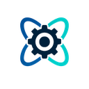
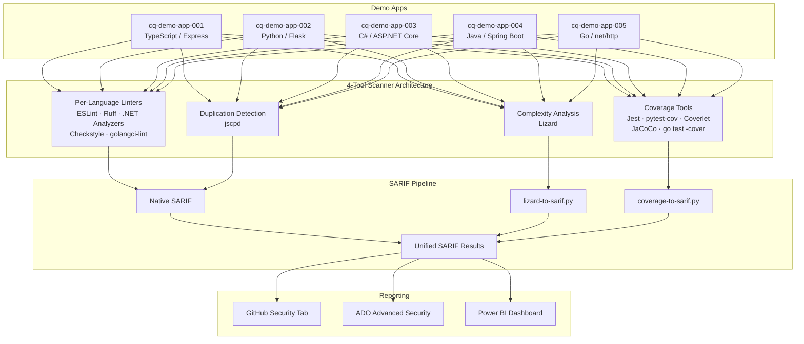

> 🇬🇧 **[English version](../)**

  

# Atelier d'analyse de la qualité du code

Bienvenue dans l'**Atelier d'analyse de la qualité du code** — un atelier pratique et progressif qui vous apprend à intégrer l'analyse de la qualité du code dans vos pipelines CI/CD à l'aide d'outils open source de référence.

> [!NOTE]
> Cet atelier fait partie du [Agentic Accelerator Framework](https://github.com/devopsabcs-engineering/agentic-accelerator-framework).

Vous analyserez cinq applications de démonstration écrites en TypeScript, Python, C#, Java et Go en utilisant une **architecture d'analyse à 4 outils** : linters par langage, détection de duplication de code, analyse de complexité cyclomatique et mesure de la couverture de tests. Tous les résultats sont normalisés au format [SARIF v2.1.0](https://docs.oasis-open.org/sarif/sarif/v2.1.0/sarif-v2.1.0.html) pour un reporting unifié dans GitHub Advanced Security ou Azure DevOps Advanced Security.

## Aperçu de l'architecture

## Prérequis

Avant de commencer l'atelier, assurez-vous d'avoir installé les éléments suivants :

- **Node.js** 20+ et npm
- **Python** 3.12+ et pip
- **.NET SDK** 8.0+
- **Java** 21+ (JDK) et Maven
- **Go** 1.22+
- **Docker Desktop** (ou Docker-in-Docker dans Codespaces)
- **Visual Studio Code** avec les extensions recommandées
- **GitHub CLI** (`gh`) authentifié avec votre compte GitHub
- Un **compte GitHub** avec accès à l'organisation `devopsabcs-engineering` (ou votre propre fork)

Consultez le [Lab 00 : Prérequis](labs/lab-00-prerequisites/) pour les instructions d'installation détaillées.

## Labs

| # | Lab | Durée | Niveau |
|---|-----|-------|--------|
| 00 | [Prérequis](labs/lab-00-prerequisites/) | 30 min | Débutant |
| 01 | [Explorer les applications de démonstration](labs/lab-01-explore-demo-apps/) | 30 min | Débutant |
| 02 | [Analyse de lint](labs/lab-02-linting/) | 45 min | Intermédiaire |
| 03 | [Analyse de complexité](labs/lab-03-complexity/) | 30 min | Intermédiaire |
| 04 | [Détection de duplication](labs/lab-04-duplication/) | 30 min | Intermédiaire |
| 05 | [Analyse de couverture](labs/lab-05-coverage/) | 45 min | Intermédiaire |
| 06 | [CI/CD avec GitHub Actions](labs/lab-06-github-actions/) | 30 min | Intermédiaire |
| 06-ADO | [CI/CD avec les pipelines ADO](labs/lab-06-ado-pipelines/) | 30 min | Intermédiaire |
| 07 | [Remédiation (GitHub)](labs/lab-07-remediation-github/) | 45 min | Avancé |
| 07-ADO | [Remédiation (ADO)](labs/lab-07-ado-remediation/) | 45 min | Avancé |
| 08 | [Tableau de bord Power BI](labs/lab-08-dashboard/) | 45 min | Avancé |

## Programme de l'atelier

### Demi-journée (3,5 heures)

| Horaire | Activité |
|---------|----------|
| 0:00 – 0:30 | Lab 00 : Prérequis |
| 0:30 – 1:00 | Lab 01 : Explorer les applications de démonstration |
| 1:00 – 1:45 | Lab 02 : Analyse de lint |
| 1:45 – 2:15 | Lab 03 : Analyse de complexité |
| 2:15 – 2:45 | Lab 04 : Détection de duplication |
| 2:45 – 3:00 | Pause |
| 3:00 – 3:30 | Lab 06 : GitHub Actions (ou Lab 06-ADO) |

### Journée complète (7 heures)

| Horaire | Activité |
|---------|----------|
| 0:00 – 0:30 | Lab 00 : Prérequis |
| 0:30 – 1:00 | Lab 01 : Explorer les applications de démonstration |
| 1:00 – 1:45 | Lab 02 : Analyse de lint |
| 1:45 – 2:15 | Lab 03 : Analyse de complexité |
| 2:15 – 2:45 | Lab 04 : Détection de duplication |
| 2:45 – 3:00 | Pause |
| 3:00 – 3:45 | Lab 05 : Analyse de couverture |
| 3:45 – 4:15 | Lab 06 : GitHub Actions |
| 4:15 – 4:45 | Lab 06-ADO : Pipelines ADO |
| 4:45 – 5:00 | Pause |
| 5:00 – 5:45 | Lab 07 : Remédiation (GitHub) |
| 5:45 – 6:30 | Lab 07-ADO : Remédiation (ADO) |
| 6:30 – 6:45 | Pause |
| 6:45 – 7:00 | Lab 08 : Tableau de bord Power BI |

## Pour commencer

1. **Forkez ou utilisez ce modèle** pour créer votre propre instance de l'atelier.
2. Complétez le [Lab 00 : Prérequis](labs/lab-00-prerequisites/) pour configurer votre environnement.
3. Parcourez les labs dans l'ordre — chaque lab s'appuie sur le précédent.

> **Astuce** : Cet atelier est conçu pour GitHub Codespaces. Cliquez sur **Code → Codespaces → New codespace** pour obtenir un environnement préconfiguré avec tous les outils installés.

## Dépôts associés

| Dépôt | Description |
|-------|-------------|
| [Agentic Accelerator Framework](https://github.com/devopsabcs-engineering/agentic-accelerator-framework) | Définitions d'agents, instructions, compétences et workflows CI/CD |
| [Agentic Accelerator Workshop](https://devopsabcs-engineering.github.io/agentic-accelerator-workshop/) | Atelier pratique pour les agents Accelerator propulsés par l'IA |
| [Accessibility Scan Workshop](https://devopsabcs-engineering.github.io/accessibility-scan-workshop/) | Atelier d'analyse d'accessibilité WCAG 2.2 |
| [FinOps Scan Workshop](https://devopsabcs-engineering.github.io/finops-scan-workshop/) | Atelier d'analyse de la gouvernance des coûts Azure |
