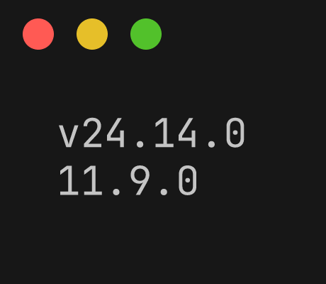
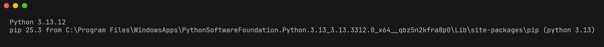
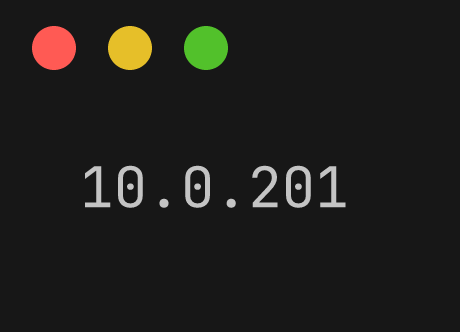
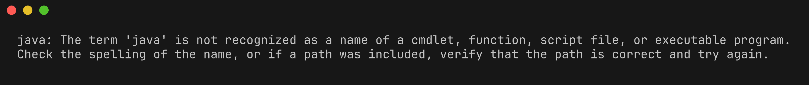
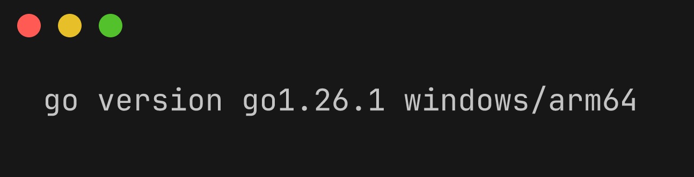
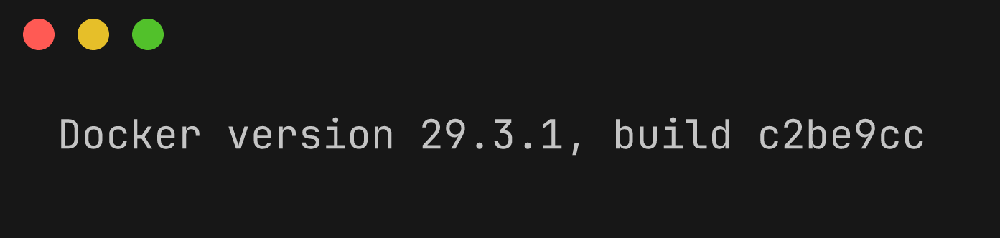
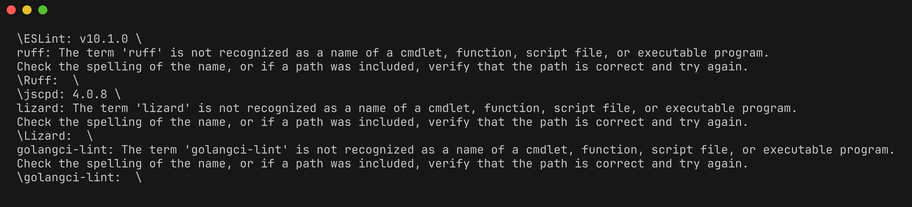
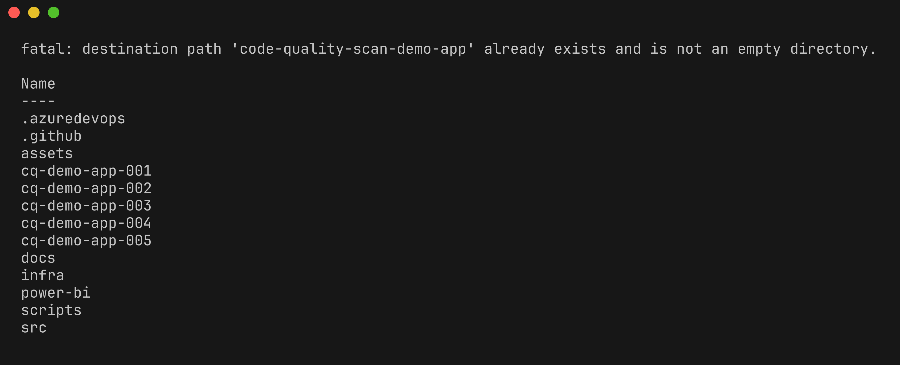

# Lab 00 : Prérequis

| Durée | Niveau | Prérequis |
|-------|--------|-----------|
| 30 min | Débutant | Aucun |

## Objectifs d'apprentissage

- Installer tous les environnements d'exécution requis (Node.js, Python, .NET, Java, Go)
- Installer les outils d'analyse de qualité du code (ESLint, Ruff, jscpd, Lizard, golangci-lint)
- Forker et cloner le dépôt `code-quality-scan-demo-app`
- Vérifier que Docker fonctionne pour les builds de conteneurs locaux
- Comprendre la structure des répertoires du workshop

## Prérequis

- Un compte GitHub avec accès à l'organisation [devopsabcs-engineering](https://github.com/devopsabcs-engineering)
- Un ordinateur avec un accès administrateur (ou un GitHub Codespace)
- Une connexion Internet pour télécharger les outils et les paquets

> **Conseil** : Si vous utilisez **GitHub Codespaces**, la plupart des outils sont pré-installés par le conteneur de développement. Passez directement à l'[Exercice 6](#exercice-6--forker-et-cloner-le-dépôt-de-lapplication-de-démonstration) après avoir vérifié les versions.

## Exercices

### Exercice 1 : Installer Node.js 20+

Téléchargez et installez Node.js depuis [nodejs.org](https://nodejs.org/) ou utilisez un gestionnaire de versions.

Vérifiez l'installation :

```powershell
node --version
npm --version
```

Vous devriez voir Node.js version 20.x ou supérieure.



### Exercice 2 : Installer Python 3.12+

Téléchargez et installez Python depuis [python.org](https://www.python.org/downloads/) ou utilisez un gestionnaire de versions.

Vérifiez l'installation :

```powershell
python --version
pip --version
```

Vous devriez voir Python version 3.12.x ou supérieure.



### Exercice 3 : Installer le SDK .NET 8

Téléchargez et installez le SDK .NET 8 depuis [dotnet.microsoft.com](https://dotnet.microsoft.com/download/dotnet/8.0).

Vérifiez l'installation :

```powershell
dotnet --version
```

Vous devriez voir la version 8.0.x ou supérieure.



### Exercice 4 : Installer Java 21+

Téléchargez et installez le JDK depuis [Adoptium](https://adoptium.net/) ou [Oracle](https://www.oracle.com/java/technologies/downloads/). Assurez-vous que Maven est également installé.

Vérifiez l'installation :

```powershell
java --version
mvn --version
```

Vous devriez voir Java version 21.x ou supérieure.



### Exercice 5 : Installer Go 1.22+

Téléchargez et installez Go depuis [go.dev](https://go.dev/dl/).

Vérifiez l'installation :

```powershell
go version
```

Vous devriez voir Go version 1.22.x ou supérieure.



### Exercice 6 : Installer Docker

Téléchargez et installez Docker Desktop depuis [docker.com](https://www.docker.com/products/docker-desktop/).

> **Codespaces** : Docker est disponible via la fonctionnalité Docker-in-Docker dans le conteneur de développement.

Vérifiez l'installation :

```powershell
docker --version
docker run hello-world
```



### Exercice 7 : Installer les outils d'analyse

Installez les 5 outils d'analyse utilisés tout au long du workshop :

**ESLint** (linter TypeScript/JavaScript) :

```powershell
npm install -g eslint@latest
eslint --version
```

**Ruff** (linter Python) :

```powershell
pip install ruff
ruff --version
```

**jscpd** (détection de duplication de code) :

```powershell
npm install -g jscpd@latest
jscpd --version
```

**Lizard** (analyse de complexité cyclomatique) :

```powershell
pip install lizard
lizard --version
```

**golangci-lint** (linter Go) :

Sous Windows (PowerShell) :

```powershell
# Download the latest release from https://github.com/golangci/golangci-lint/releases
# Or use go install:
go install github.com/golangci/golangci-lint/cmd/golangci-lint@latest
golangci-lint --version
```

Sous macOS/Linux :

```powershell
curl -sSfL https://raw.githubusercontent.com/golangci/golangci-lint/master/install.sh | sh -s -- -b $(go env GOPATH)/bin latest
golangci-lint --version
```

Vérifiez que tous les outils sont installés :

```powershell
Write-Host "ESLint:        $(eslint --version)"
Write-Host "Ruff:          $(ruff --version)"
Write-Host "jscpd:         $(jscpd --version)"
Write-Host "Lizard:        $(lizard --version)"
Write-Host "golangci-lint: $(golangci-lint --version)"
```



### Exercice 8 : Forker et cloner le dépôt de l'application de démonstration

Forkez le dépôt `code-quality-scan-demo-app` vers votre compte GitHub :

```powershell
gh repo fork devopsabcs-engineering/code-quality-scan-demo-app --clone
cd code-quality-scan-demo-app
```

Si vous préférez cloner sans forker (lecture seule) :

```powershell
git clone https://github.com/devopsabcs-engineering/code-quality-scan-demo-app.git
cd code-quality-scan-demo-app
```

Vérifiez la structure des répertoires :

```powershell
Get-ChildItem -Directory | Select-Object Name
```

Vous devriez voir 5 répertoires d'applications de démonstration :

```
cq-demo-app-001
cq-demo-app-002
cq-demo-app-003
cq-demo-app-004
cq-demo-app-005
```



### Exercice 9 : Vérifier les builds Docker

Testez que vous pouvez construire l'une des applications de démonstration en tant que conteneur Docker :

> **Répertoire de travail** : Exécutez les commandes suivantes depuis la racine du dépôt `code-quality-scan-demo-app`.

```powershell
cd cq-demo-app-001
docker build -t cq-demo-app-001 .
docker run -d -p 3000:3000 --name cq-test cq-demo-app-001
```

Ouvrez [http://localhost:3000](http://localhost:3000) dans votre navigateur pour vérifier que l'application fonctionne.

Nettoyez le conteneur de test :

```powershell
docker stop cq-test
docker rm cq-test
cd ..
```

## Point de vérification

Vérifiez votre configuration avant de continuer :

- [ ] Node.js 20+ est installé (`node --version`)
- [ ] Python 3.12+ est installé (`python --version`)
- [ ] Le SDK .NET 8 est installé (`dotnet --version`)
- [ ] Java 21+ est installé (`java --version`)
- [ ] Go 1.22+ est installé (`go version`)
- [ ] Docker fonctionne (`docker run hello-world`)
- [ ] ESLint est installé (`eslint --version`)
- [ ] Ruff est installé (`ruff --version`)
- [ ] jscpd est installé (`jscpd --version`)
- [ ] Lizard est installé (`lizard --version`)
- [ ] golangci-lint est installé (`golangci-lint --version`)
- [ ] Le dépôt demo-app est cloné avec les 5 répertoires d'applications visibles

## Résumé

Vous avez mis en place un environnement de développement complet pour l'analyse de qualité du code. Les 5 environnements d'exécution, les 5 outils d'analyse et Docker sont prêts à être utilisés. Le dépôt demo-app est cloné avec 5 applications d'exemple contenant des violations de qualité intentionnelles.

## Étapes suivantes

Passez au [Lab 01 : Explorer les applications de démonstration](../lab-01-explore-demo-apps/).
