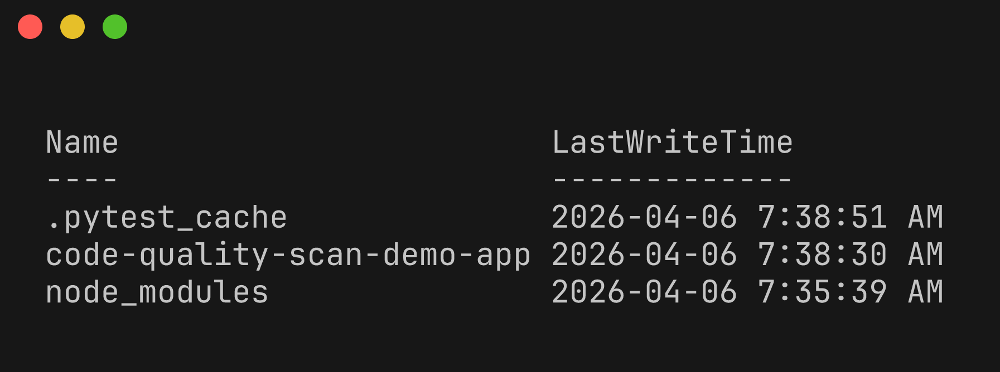
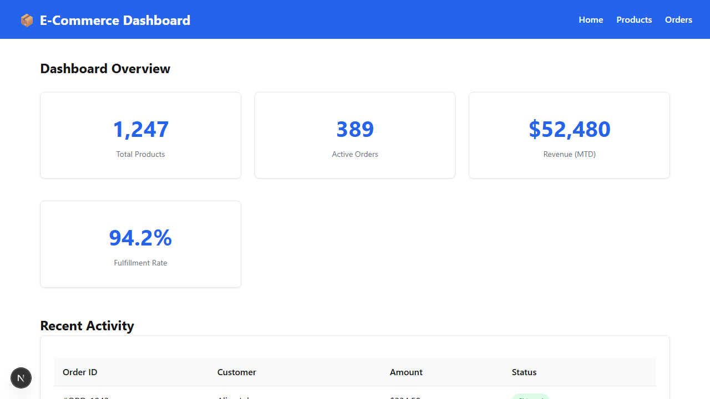
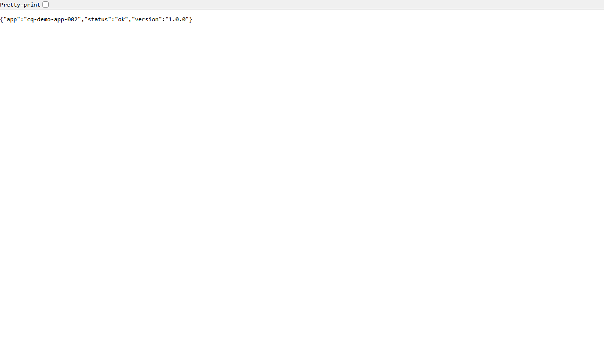
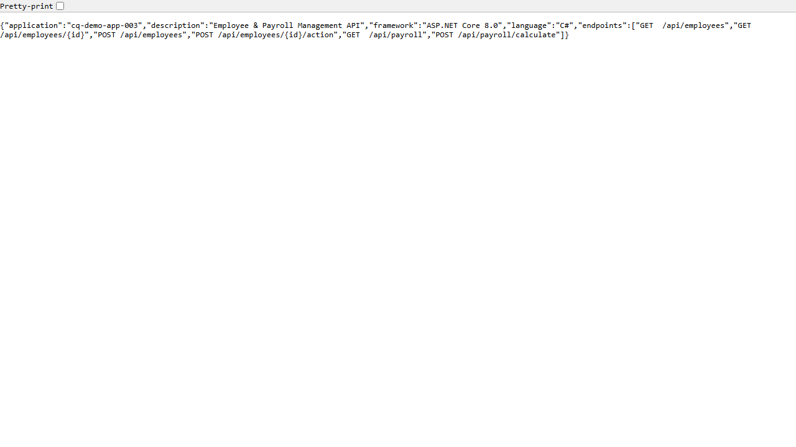
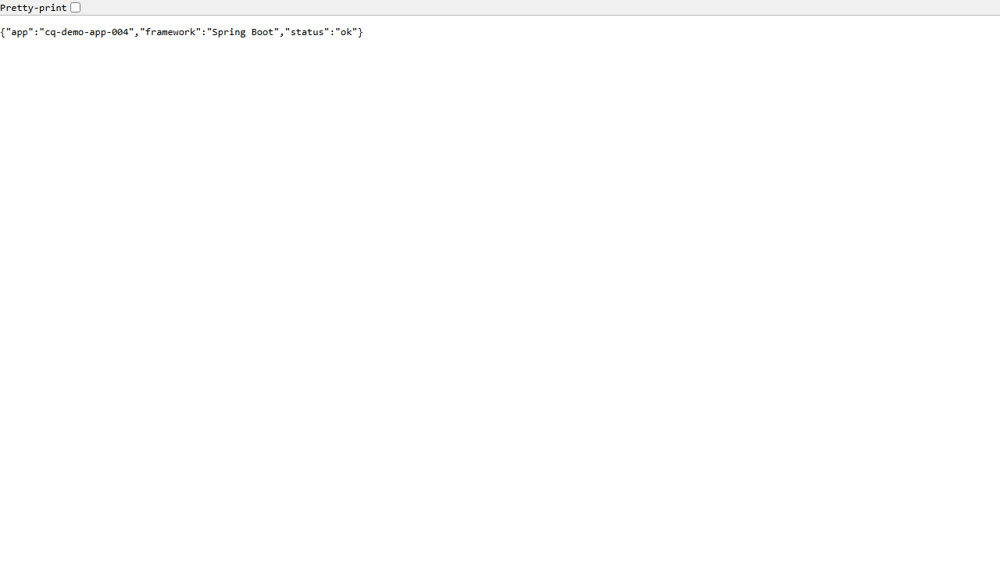
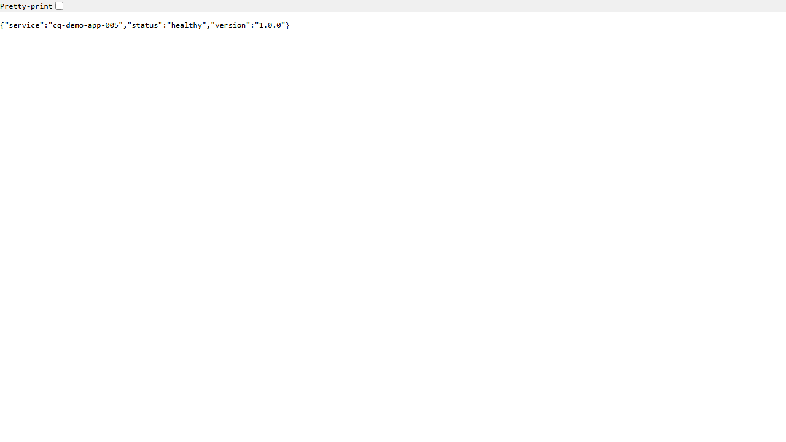
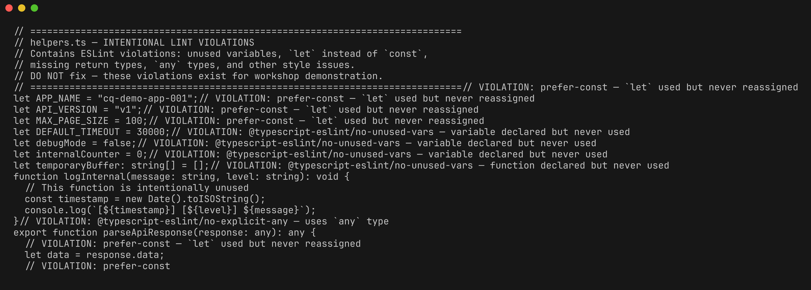

# Lab 01 : Explorer les applications de démonstration

| Durée | Niveau | Prérequis |
|-------|--------|-----------|
| 30 min | Débutant | Lab 00 |

## Objectifs d'apprentissage

- Comprendre la structure des 5 applications de démonstration en 5 langages
- Identifier les types de violations intentionnelles de qualité de code intégrées dans chaque application
- Exécuter chaque application de démonstration localement avec Docker
- Naviguer dans l'organisation du dépôt et comprendre comment les fichiers sont liés aux outils d'analyse

## Prérequis

- Avoir terminé le [Lab 00 : Prérequis](../lab-00-prerequisites/)
- Le dépôt `code-quality-scan-demo-app` cloné localement

## Exercices

### Exercice 1 : Explorer la structure du dépôt

> **Répertoire de travail** : Exécutez les commandes suivantes depuis la racine du dépôt `code-quality-scan-demo-app`.

Affichez la structure des répertoires de premier niveau :

```powershell
Get-ChildItem -Directory | Format-Table Name, LastWriteTime
```

Vous devriez voir les répertoires clés suivants :

| Répertoire | Langage | Framework |
|------------|---------|-----------|
| `cq-demo-app-001` | TypeScript | Express |
| `cq-demo-app-002` | Python | Flask |
| `cq-demo-app-003` | C# | ASP.NET Core |
| `cq-demo-app-004` | Java | Spring Boot |
| `cq-demo-app-005` | Go | net/http |

Les répertoires supplémentaires incluent `src/converters/` (convertisseurs SARIF), `src/config/` (configurations des outils), `scripts/` (amorçage et pipeline de données) et `power-bi/` (tableau de bord PBIP).



### Exercice 2 : Explorer cq-demo-app-001 (TypeScript / Express)

Parcourez l'application de démonstration TypeScript :

```powershell
Get-ChildItem cq-demo-app-001 -Recurse -File | Select-Object FullName | Select-Object -First 20
```

Fichiers clés à examiner :

| Fichier | Objectif |
|---------|----------|
| `src/index.ts` | Point d'entrée du serveur Express |
| `src/routes/` | Gestionnaires de routes API |
| `src/utils/` | Fonctions utilitaires avec des violations de complexité/duplication |
| `Dockerfile` | Build Docker multi-étapes |
| `infra/main.bicep` | Infrastructure de déploiement Azure |
| `eslint.config.mjs` | Configuration ESLint |

**Violations intentionnelles dans cette application :**
- Violations `prefer-const` (utilisation de `let` là où `const` devrait être utilisé)
- Variables et imports inutilisés
- Fonctions avec une complexité cyclomatique > 10
- Fonctions utilitaires dupliquées
- Faible couverture de tests (< 50 %)

Construisez et exécutez l'application :

```powershell
cd cq-demo-app-001
docker build -t cq-demo-app-001 .
docker run -d -p 3000:3000 --name app001 cq-demo-app-001
```

Ouvrez [http://localhost:3000](http://localhost:3000) pour voir l'application en cours d'exécution.



Nettoyage :

```powershell
docker stop app001; docker rm app001
cd ..
```

### Exercice 3 : Explorer cq-demo-app-002 (Python / Flask)

Parcourez l'application de démonstration Python :

```powershell
Get-ChildItem cq-demo-app-002 -Recurse -File | Select-Object FullName | Select-Object -First 20
```

Fichiers clés :

| Fichier | Objectif |
|---------|----------|
| `src/app.py` | Point d'entrée de l'application Flask |
| `src/services/` | Logique métier avec des violations |
| `src/utils/` | Fonctions utilitaires |
| `pyproject.toml` | Configuration du projet Python avec les paramètres Ruff |
| `Dockerfile` | Définition de la construction du conteneur |

**Violations intentionnelles :**
- Imports et variables inutilisés (Ruff F401, F841)
- Annotations de type manquantes
- Fonctions dépassant 50 lignes
- Logique de validation de données dupliquée
- Couverture de tests minimale

Construisez et exécutez :

```powershell
cd cq-demo-app-002
docker build -t cq-demo-app-002 .
docker run -d -p 5000:5000 --name app002 cq-demo-app-002
```

Ouvrez [http://localhost:5000](http://localhost:5000) pour vérifier.



Nettoyage :

```powershell
docker stop app002; docker rm app002
cd ..
```

### Exercice 4 : Explorer cq-demo-app-003 (C# / ASP.NET Core)

Parcourez l'application de démonstration C# :

```powershell
Get-ChildItem cq-demo-app-003 -Recurse -File -Include *.cs,*.csproj,*.bicep,Dockerfile | Select-Object FullName | Select-Object -First 20
```

Fichiers clés :

| Fichier | Objectif |
|---------|----------|
| `src/Program.cs` | Point d'entrée ASP.NET Core |
| `src/Controllers/` | Contrôleurs API |
| `src/Services/` | Logique métier avec des violations |
| `src/*.csproj` | Fichier de projet avec les paramètres de l'analyseur |
| `.editorconfig` | Règles de l'analyseur .NET |

**Violations intentionnelles :**
- CA1822 (méthodes pouvant être rendues statiques)
- CA2007 (ConfigureAwait manquant)
- Complexité cyclomatique élevée dans les méthodes de traitement de données
- Logique de validation dupliquée entre les contrôleurs
- Tests unitaires manquants pour la couche de services

Construisez et exécutez :

```powershell
cd cq-demo-app-003
docker build -t cq-demo-app-003 .
docker run -d -p 8080:8080 --name app003 cq-demo-app-003
```

Ouvrez [http://localhost:8080](http://localhost:8080) pour vérifier.



Nettoyage :

```powershell
docker stop app003; docker rm app003
cd ..
```

### Exercice 5 : Explorer cq-demo-app-004 (Java / Spring Boot)

Parcourez l'application de démonstration Java :

```powershell
Get-ChildItem cq-demo-app-004 -Recurse -File -Include *.java,pom.xml,Dockerfile | Select-Object FullName | Select-Object -First 20
```

Fichiers clés :

| Fichier | Objectif |
|---------|----------|
| `src/main/java/.../Application.java` | Point d'entrée Spring Boot |
| `src/main/java/.../controllers/` | Contrôleurs REST |
| `src/main/java/.../services/` | Couche de services avec des violations |
| `pom.xml` | Build Maven avec le plugin Checkstyle |
| `checkstyle.xml` | Configuration Checkstyle |

**Violations intentionnelles :**
- Violations des conventions de nommage Checkstyle
- Méthodes dépassant la longueur recommandée
- Conditions profondément imbriquées (> 4 niveaux)
- Méthodes utilitaires copiées-collées
- Cas de test JUnit manquants

Construisez et exécutez :

```powershell
cd cq-demo-app-004
docker build -t cq-demo-app-004 .
docker run -d -p 8080:8080 --name app004 cq-demo-app-004
```

Ouvrez [http://localhost:8080](http://localhost:8080) pour vérifier.



Nettoyage :

```powershell
docker stop app004; docker rm app004
cd ..
```

### Exercice 6 : Explorer cq-demo-app-005 (Go / net/http)

Parcourez l'application de démonstration Go :

```powershell
Get-ChildItem cq-demo-app-005 -Recurse -File -Include *.go,go.mod,Dockerfile | Select-Object FullName | Select-Object -First 20
```

Fichiers clés :

| Fichier | Objectif |
|---------|----------|
| `main.go` | Point d'entrée du serveur HTTP |
| `handlers/` | Fonctions de gestion des requêtes |
| `utils/` | Fonctions utilitaires avec des violations |
| `go.mod` | Définition du module Go |
| `.golangci.yml` | Configuration golangci-lint |

**Violations intentionnelles :**
- `errcheck` — retours d'erreurs non vérifiés
- `ineffassign` — affectations inefficaces
- Complexité cyclomatique élevée dans les fonctions d'analyse
- Logique de traitement de chaînes dupliquée
- Aucun fichier de test (`*_test.go`)

Construisez et exécutez :

```powershell
cd cq-demo-app-005
docker build -t cq-demo-app-005 .
docker run -d -p 8080:8080 --name app005 cq-demo-app-005
```

Ouvrez [http://localhost:8080](http://localhost:8080) pour vérifier.



Nettoyage :

```powershell
docker stop app005; docker rm app005
cd ..
```

### Exercice 7 : Aperçu des problèmes de qualité de code

Ouvrez n'importe quelle application de démonstration dans VS Code et recherchez les motifs de violations courants :

```powershell
code cq-demo-app-001
```

Recherchez ces motifs :

1. **Variables inutilisées** : Variables déclarées mais jamais référencées
2. **Fonctions longues** : Fonctions de plus de 50 lignes
3. **Conditions imbriquées** : Chaînes `if/else` imbriquées sur 4 niveaux ou plus
4. **Blocs copiés-collés** : Blocs de code similaires dans différents fichiers
5. **Tests manquants** : Fichiers source sans fichiers de test correspondants



## Point de vérification

Vérifiez votre travail avant de continuer :

- [ ] Vous pouvez lister les 5 répertoires d'applications de démonstration (`cq-demo-app-001` à `005`)
- [ ] Vous avez réussi à construire et exécuter au moins une application de démonstration avec Docker
- [ ] Vous pouvez identifier au moins 3 types de violations intentionnelles dans le code source
- [ ] Vous comprenez l'objectif des répertoires `src/converters/`, `src/config/` et `scripts/`

## Résumé

Le dépôt `code-quality-scan-demo-app` contient 5 applications de démonstration, chacune écrite dans un langage et un framework différents. Chaque application inclut des violations intentionnelles de qualité de code — erreurs de lint, complexité élevée, duplication de code et faible couverture de tests — que vous détecterez et corrigerez dans les labs suivants.

Toutes les applications suivent une structure cohérente avec du code source, un Dockerfile, une infrastructure Bicep et un workflow de déploiement. Elles peuvent toutes être construites et exécutées localement avec Docker, ce qui les rend idéales pour des exercices pratiques d'analyse.

## Étapes suivantes

Passez au [Lab 02 : Linting](../lab-02-linting/).
