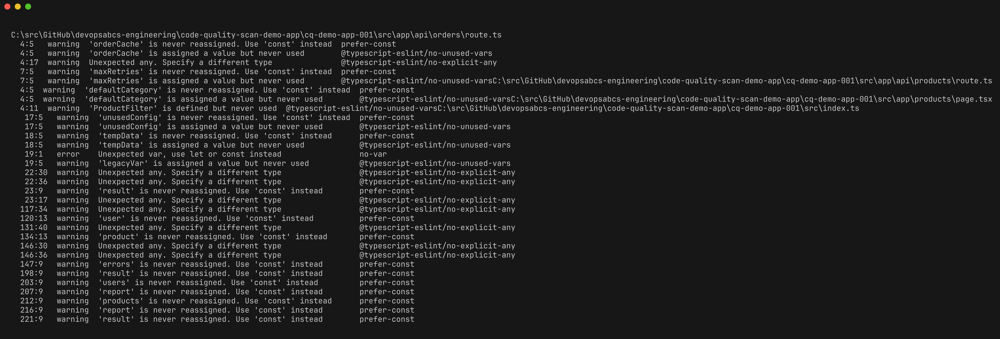
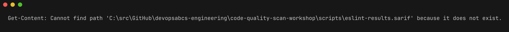
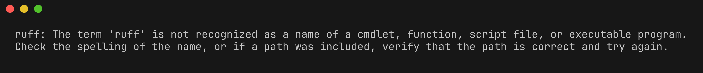
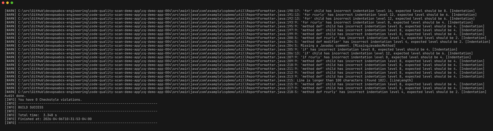
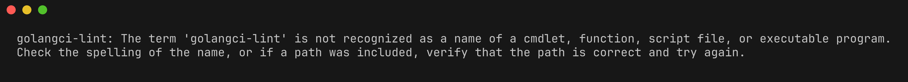
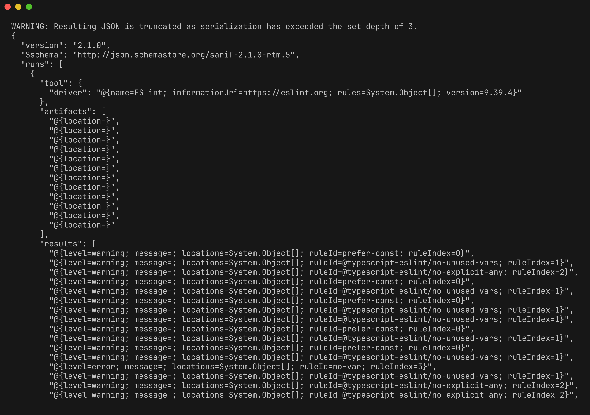

# Lab 02 : Analyse de lint

| Durée | Niveau | Prérequis |
|-------|--------|-----------|
| 45 min | Intermédiaire | Lab 01 |

## Objectifs d'apprentissage

- Exécuter ESLint sur du code TypeScript et interpréter les résultats de lint
- Exécuter Ruff sur du code Python et comprendre les catégories de règles
- Exécuter .NET Analyzers sur du code C#
- Exécuter Checkstyle sur du code Java
- Exécuter golangci-lint sur du code Go
- Comprendre le format de sortie SARIF pour les résultats des linters

## Prérequis

- [Lab 01 : Explorer les applications de démonstration](../lab-01-explore-demo-apps/) terminé
- Tous les outils d'analyse installés (ESLint, Ruff, golangci-lint)

## Exercices

### Exercice 1 : Exécuter ESLint sur TypeScript (cq-demo-app-001)

> **Répertoire de travail** : Exécutez les commandes suivantes depuis la racine du dépôt `code-quality-scan-demo-app`.

Naviguez vers l'application de démonstration TypeScript et installez les dépendances :

```powershell
cd cq-demo-app-001
npm install
```

Exécutez ESLint avec le formateur stylish par défaut pour obtenir une sortie lisible :

```powershell
npx eslint src/ --format stylish
```

Vous devriez voir des violations telles que :

- `prefer-const` — variables déclarées avec `let` qui ne sont jamais réassignées
- `@typescript-eslint/no-unused-vars` — variables déclarées mais non utilisées
- `@typescript-eslint/no-explicit-any` — utilisation du type `any` au lieu de types spécifiques



Exécutez maintenant ESLint avec une sortie SARIF pour voir le format lisible par machine :

```powershell
npx eslint src/ --format @microsoft/eslint-formatter-sarif --output-file eslint-results.sarif
```

> **Remarque** : Si le formateur SARIF n'est pas installé, installez-le d'abord :
> ```powershell
> npm install -D @microsoft/eslint-formatter-sarif
> ```

Examinez la sortie SARIF :

```powershell
Get-Content eslint-results.sarif | ConvertFrom-Json | ConvertTo-Json -Depth 10 | Select-Object -First 60
```



```powershell
cd ..
```

### Exercice 2 : Exécuter Ruff sur Python (cq-demo-app-002)

Naviguez vers l'application de démonstration Python et exécutez Ruff :

```powershell
cd cq-demo-app-002
ruff check src/
```

Ruff organise les règles par préfixe de catégorie :

| Préfixe | Catégorie | Exemple |
|---------|-----------|---------|
| `F` | Pyflakes — erreurs de logique | F401 (import inutilisé), F841 (variable inutilisée) |
| `E` | pycodestyle — erreurs de style | E501 (ligne trop longue) |
| `W` | pycodestyle — avertissements | W291 (espace blanc en fin de ligne) |
| `I` | isort — ordre des imports | I001 (imports non triés) |
| `N` | pep8-naming — conventions de nommage | N802 (le nom de fonction doit être en minuscules) |



Exécutez Ruff avec une sortie SARIF :

```powershell
ruff check src/ --output-format sarif --output-file ruff-results.sarif
```

```powershell
cd ..
```

### Exercice 3 : Exécuter .NET Analyzers sur C# (cq-demo-app-003)

Naviguez vers l'application de démonstration C# et compilez avec les analyseurs activés :

```powershell
cd cq-demo-app-003
dotnet build /p:TreatWarningsAsErrors=false -warnaserror- 2>&1 | Select-String "warning CA|error CA"
```

Les résultats courants de .NET Analyzers incluent :

| Règle | Description |
|-------|-------------|
| CA1822 | Marquer les membres comme statiques |
| CA2007 | Envisager l'appel à ConfigureAwait |
| CA1062 | Valider les arguments des méthodes publiques |
| CA1031 | Ne pas intercepter les types d'exception généraux |
| IDE0060 | Supprimer le paramètre inutilisé |


Pour générer une sortie SARIF à partir de la compilation .NET :

```powershell
dotnet build /p:ErrorLog=dotnet-results.sarif,version=2.1
```

```powershell
cd ..
```

### Exercice 4 : Exécuter Checkstyle sur Java (cq-demo-app-004)

Naviguez vers l'application de démonstration Java et exécutez Checkstyle via Maven :

```powershell
cd cq-demo-app-004
.\mvnw.cmd checkstyle:check 2>&1 | Select-Object -Last 30
```

> **Remarque sur la compatibilité multiplateforme** : Sur Linux/macOS, utilisez `./mvnw` au lieu de `.\mvnw.cmd`.

Résultats courants de Checkstyle :

| Règle | Description |
|-------|-------------|
| `NamingConvention` | Violations de convention de nommage des méthodes/variables |
| `LineLength` | Lignes dépassant 120 caractères |
| `MagicNumber` | Littéraux numériques codés en dur |
| `JavadocMethod` | Javadoc manquant sur les méthodes publiques |
| `CyclomaticComplexity` | Méthodes avec une complexité > 10 |



```powershell
cd ..
```

### Exercice 5 : Exécuter golangci-lint sur Go (cq-demo-app-005)

Naviguez vers l'application de démonstration Go et exécutez golangci-lint :

```powershell
cd cq-demo-app-005
golangci-lint run ./...
```

Résultats courants de golangci-lint :

| Linter | Description |
|--------|-------------|
| `errcheck` | Valeurs de retour d'erreur non vérifiées |
| `ineffassign` | Affectations à des variables jamais utilisées par la suite |
| `staticcheck` | Analyse statique avancée |
| `govet` | Signale les constructions suspectes |
| `unused` | Variables, fonctions ou types inutilisés |



Exécutez avec une sortie SARIF (golangci-lint ne produit pas nativement du SARIF, mais vous pouvez utiliser JSON et convertir) :

```powershell
golangci-lint run ./... --out-format json > golangci-lint-results.json
```

```powershell
cd ..
```

### Exercice 6 : Comprendre le format SARIF

Ouvrez l'un des fichiers SARIF générés lors des exercices précédents. Un résultat SARIF ressemble à ceci :

```json
{
  "$schema": "https://raw.githubusercontent.com/oasis-tcs/sarif-spec/main/sarif-2.1/schema/sarif-schema-2.1.0.json",
  "version": "2.1.0",
  "runs": [
    {
      "tool": {
        "driver": {
          "name": "ESLint",
          "rules": [
            {
              "id": "prefer-const",
              "shortDescription": { "text": "Require const for variables that are never reassigned" },
              "helpUri": "https://eslint.org/docs/rules/prefer-const"
            }
          ]
        }
      },
      "results": [
        {
          "ruleId": "prefer-const",
          "level": "warning",
          "message": { "text": "'x' is never reassigned. Use 'const' instead." },
          "locations": [
            {
              "physicalLocation": {
                "artifactLocation": { "uri": "src/utils/helpers.ts" },
                "region": { "startLine": 15, "startColumn": 7 }
              }
            }
          ]
        }
      ]
    }
  ]
}
```

Concepts clés du format SARIF :

| Élément | Objectif |
|---------|----------|
| `tool.driver.name` | Identifie l'outil d'analyse |
| `tool.driver.rules` | Définitions des règles avec descriptions |
| `results[].ruleId` | Relie le résultat à sa définition de règle |
| `results[].level` | Sévérité : `error`, `warning` ou `note` |
| `results[].locations` | Chemin du fichier, numéro de ligne et colonne |
| `results[].message` | Description lisible du résultat |



## Point de vérification

Vérifiez votre travail avant de continuer :

- [ ] ESLint a produit des avertissements/erreurs pour `cq-demo-app-001`
- [ ] Ruff a trouvé des violations dans `cq-demo-app-002`
- [ ] .NET Analyzers a signalé des résultats pour `cq-demo-app-003`
- [ ] Checkstyle a identifié des violations dans `cq-demo-app-004`
- [ ] golangci-lint a trouvé des problèmes dans `cq-demo-app-005`
- [ ] Vous avez généré au moins un fichier de sortie SARIF
- [ ] Vous pouvez expliquer les champs clés d'un résultat SARIF

## Résumé

Les linters par langage constituent la première ligne de défense en matière de qualité du code. Chaque outil se spécialise dans son écosystème de langage — ESLint pour TypeScript/JavaScript, Ruff pour Python, .NET Analyzers pour C#, Checkstyle pour Java et golangci-lint pour Go. En produisant les résultats au format SARIF, tous les résultats peuvent être agrégés dans une vue unifiée dans l'onglet Sécurité de GitHub ou ADO Advanced Security.

## Étapes suivantes

Passez au [Lab 03 : Analyse de complexité](../lab-03-complexity/).
