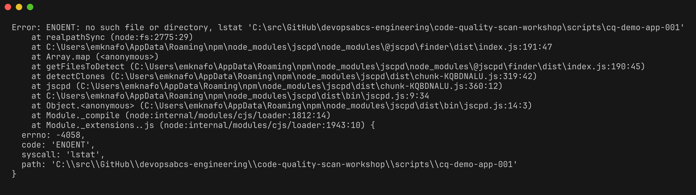
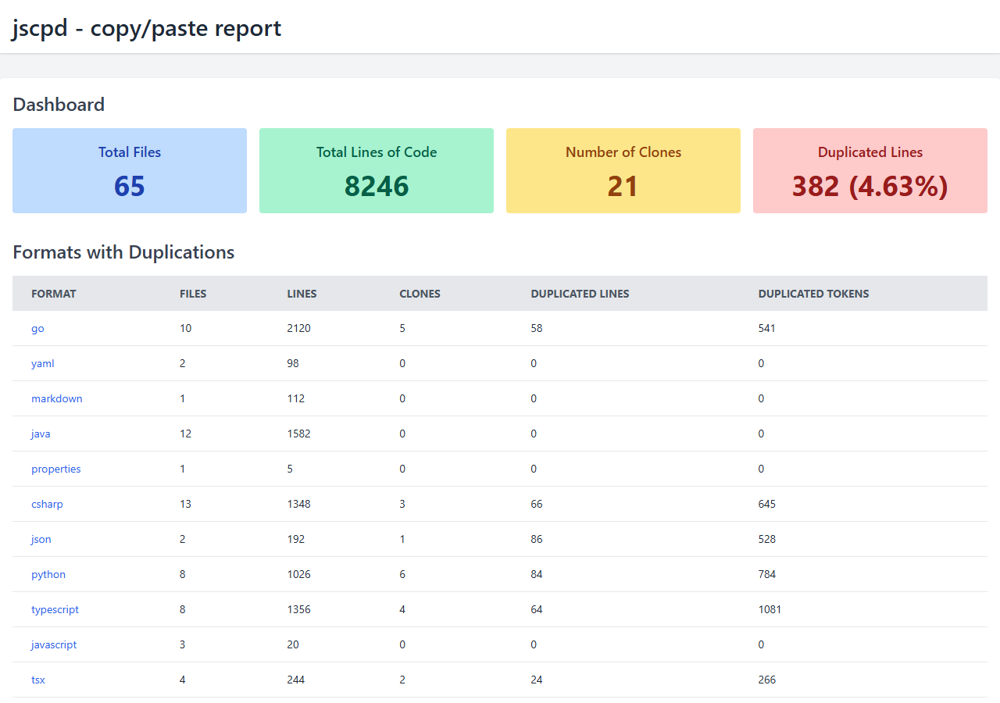
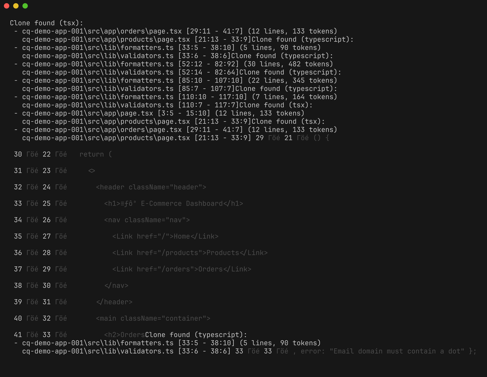
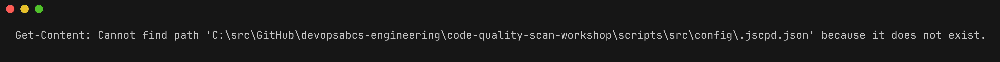

# Lab 04 : Détection de duplication

| Durée | Niveau | Prérequis |
|-------|--------|-----------|
| 30 min | Intermédiaire | Lab 03 |

## Objectifs d'apprentissage

- Exécuter jscpd pour détecter la duplication de code dans plusieurs langages
- Interpréter les rapports de duplication et comprendre les types de clones
- Configurer les seuils de jscpd à l'aide de `.jscpd.json`
- Comprendre la relation entre la duplication et la maintenabilité
- Examiner la sortie SARIF de jscpd

## Prérequis

- [Lab 03 : Analyse de complexité](../lab-03-complexity/) terminé
- jscpd installé (`npm install -g jscpd`)

## Exercices

### Exercice 1 : Exécuter jscpd sur la base de code

> **Répertoire de travail** : Exécutez les commandes suivantes depuis la racine du dépôt `code-quality-scan-demo-app`.

Exécutez jscpd sur les 5 applications de démonstration :

```powershell
jscpd cq-demo-app-001/src cq-demo-app-002/src cq-demo-app-003/src cq-demo-app-004/src cq-demo-app-005/
```

jscpd recherche les blocs de code dupliqué (clones) dans les fichiers et les langages. La sortie affiche :

- Les emplacements des fichiers **source** et **cible**
- Les **lignes** de code dupliqué
- Le **pourcentage** de duplication dans la base de code



### Exercice 2 : Générer un rapport HTML

Générez un rapport HTML détaillé pour une inspection visuelle :

```powershell
jscpd cq-demo-app-001/src cq-demo-app-002/src cq-demo-app-003/src cq-demo-app-004/src cq-demo-app-005/ --reporters html --output jscpd-report
```

Ouvrez le rapport :

```powershell
# Dans un Codespace, utilisez l'aperçu intégré ou le transfert de port
# Localement, ouvrez le fichier directement :
Start-Process jscpd-report/html/index.html
```

Le rapport HTML fournit :

- Un tableau récapitulatif montrant le pourcentage de duplication par fichier
- Une comparaison côte à côte des blocs dupliqués
- Des métriques de duplication au niveau des fichiers et du projet



### Exercice 3 : Comprendre les types de clones

jscpd détecte différents types de clones de code :

| Type | Nom | Description | Exemple |
|------|-----|-------------|---------|
| Type 1 | Exact | Blocs de code identiques (les espaces/commentaires peuvent différer) | Fonction copiée-collée |
| Type 2 | Renommé | Structurellement identique mais avec des identifiants renommés | Même logique avec des noms de variables différents |
| Type 3 | Quasi-identique | Code similaire avec des modifications mineures | Même algorithme avec quelques lignes supplémentaires |

Examinez un clone détecté en détail :

```powershell
jscpd cq-demo-app-001/src cq-demo-app-002/src --min-lines 5 --reporters consoleFull
```



### Exercice 4 : Configurer les seuils de détection

jscpd peut être configuré avec un fichier `.jscpd.json` à la racine du dépôt. Examinez la configuration existante :

```powershell
Get-Content src/config/.jscpd.json
```

Une configuration typique ressemble à :

```json
{
  "threshold": 5,
  "reporters": ["json", "consoleFull"],
  "ignore": [
    "**/node_modules/**",
    "**/*.test.*",
    "**/*_test.go",
    "**/bin/**",
    "**/obj/**",
    "**/target/**"
  ],
  "minLines": 10,
  "minTokens": 50,
  "output": "jscpd-report"
}
```

Options de configuration principales :

| Option | Défaut | Description |
|--------|--------|-------------|
| `threshold` | 0 | Pourcentage maximal de duplication autorisé (0 = pas de limite) |
| `minLines` | 5 | Nombre minimum de lignes pour qu'un bloc soit considéré comme un clone |
| `minTokens` | 50 | Nombre minimum de jetons pour qu'un bloc soit considéré comme un clone |
| `ignore` | `[]` | Motifs glob pour les fichiers/répertoires à exclure |
| `reporters` | `["consoleFull"]` | Formats de sortie : `console`, `consoleFull`, `json`, `html`, `sarif` |



### Exercice 5 : Générer une sortie SARIF

Exécutez jscpd avec une sortie SARIF pour l'intégration avec l'onglet Sécurité de GitHub :

```powershell
jscpd cq-demo-app-001/src cq-demo-app-002/src cq-demo-app-003/src cq-demo-app-004/src cq-demo-app-005/ --reporters sarif --output jscpd-report
```

Examinez la sortie SARIF :

```powershell
Get-Content jscpd-report/sarif/jscpd-report.sarif | ConvertFrom-Json | Select-Object -ExpandProperty runs | Select-Object -ExpandProperty results | Measure-Object
```

Chaque résultat SARIF de jscpd inclut :

- `ruleId` : `jscpd:duplication`
- `level` : `warning`
- `message` : Description du bloc dupliqué avec les emplacements source et cible
- `locations` : Chemins de fichiers et plages de lignes

### Exercice 6 : Expérimenter avec les seuils

Essayez différentes valeurs de seuil pour observer leur effet :

**Strict (détecter les petits clones) :**

```powershell
jscpd cq-demo-app-001/src --min-lines 5 --min-tokens 25
```

**Souple (uniquement les grands blocs) :**

```powershell
jscpd cq-demo-app-001/src --min-lines 20 --min-tokens 100
```

Observez comment le nombre de clones détectés change avec différents seuils. La valeur par défaut de l'atelier de 10 lignes / 50 jetons offre un bon équilibre entre le bruit et la couverture de détection.

## Point de vérification

Vérifiez votre travail avant de continuer :

- [ ] jscpd s'est exécuté avec succès sur les 5 applications de démonstration
- [ ] Vous avez généré un rapport HTML montrant les emplacements de duplication
- [ ] Vous pouvez expliquer la différence entre les clones de Type 1, Type 2 et Type 3
- [ ] Vous comprenez les options de configuration de `.jscpd.json`
- [ ] Vous avez généré une sortie SARIF à partir de jscpd

## Résumé

La duplication de code est un risque de maintenabilité — lorsque du code dupliqué doit être modifié, chaque copie doit être mise à jour. jscpd détecte les blocs dupliqués dans les fichiers et les langages, ce qui le rend idéal pour les dépôts multi-langages. En configurant des seuils appropriés et en générant une sortie SARIF, les résultats de duplication s'intègrent dans le même flux de travail de triage que les résultats de linting et de complexité.

**Stratégies de remédiation** pour la duplication :
- Extraire la logique partagée dans des fonctions ou modules utilitaires
- Utiliser des classes de base ou des traits pour les motifs répétés
- Appliquer le principe DRY (Don't Repeat Yourself)

## Étapes suivantes

Passez au [Lab 05 : Analyse de couverture](../lab-05-coverage/).
