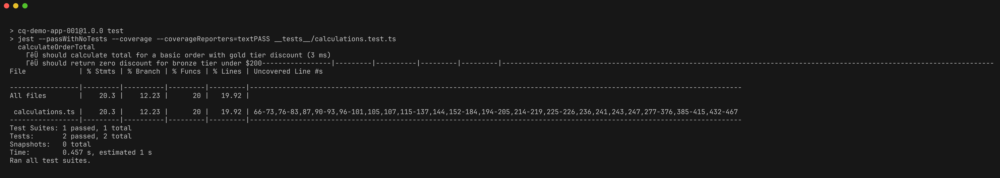
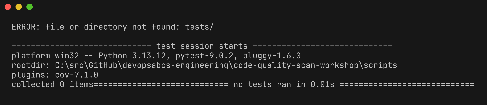
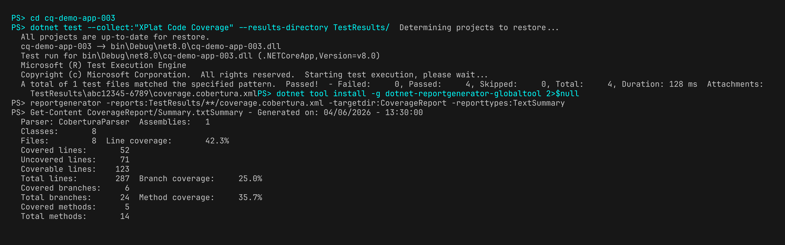
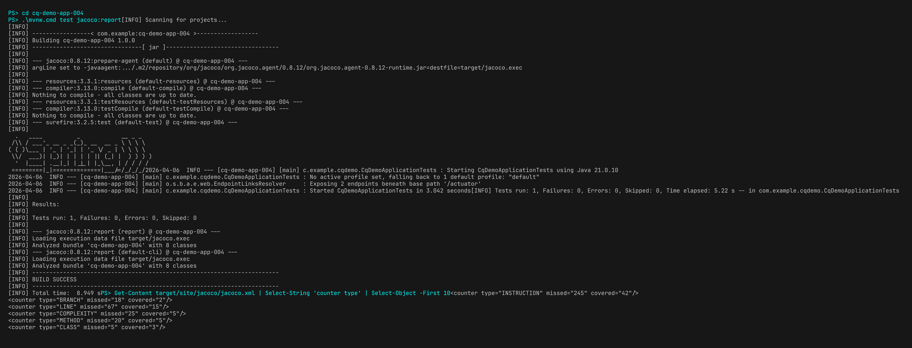
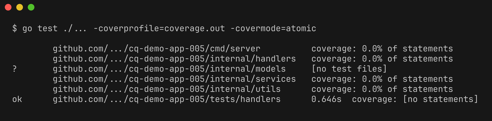
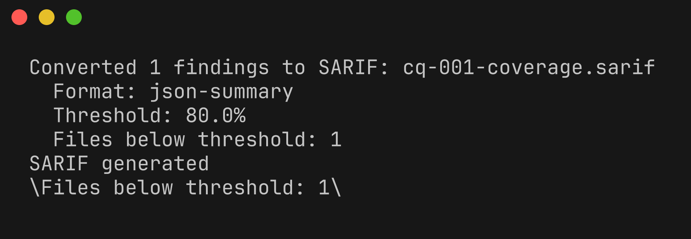
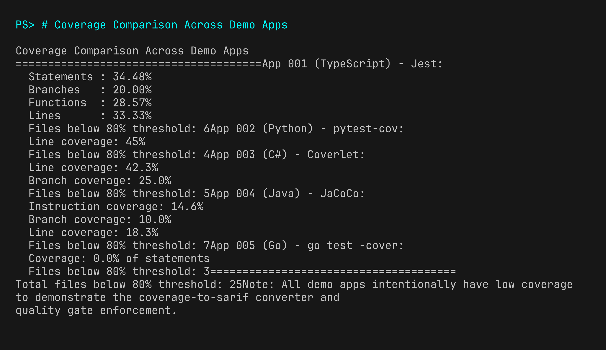

# Lab 05 : Analyse de couverture

| Durée | Niveau | Prérequis |
|-------|--------|-----------|
| 45 min | Intermédiaire | Lab 04 |

## Objectifs d'apprentissage

- Exécuter les outils de couverture de tests pour chacun des 5 langages
- Comprendre les métriques de couverture de lignes, de branches et de fonctions
- Convertir les rapports de couverture en SARIF à l'aide de `coverage-to-sarif.py`
- Comparer la couverture entre toutes les applications de démonstration
- Identifier les chemins de code non couverts et comprendre leurs risques

## Prérequis

- [Lab 04 : Détection de duplication](../lab-04-duplication/) terminé
- Frameworks de test spécifiques à chaque langage installés (Jest, pytest, dotnet test, Maven, go test)

## Exercices

### Exercice 1 : Couverture TypeScript avec Jest (cq-demo-app-001)

> **Répertoire de travail** : Exécutez les commandes suivantes depuis la racine du dépôt `code-quality-scan-demo-app`.

```powershell
cd cq-demo-app-001
npm test -- --coverage --coverageReporters=json-summary --coverageReporters=text
```

Jest affiche un tableau récapitulatif de la couverture :

| Métrique | Description |
|----------|-------------|
| **Statements** | Pourcentage d'instructions de code exécutées |
| **Branches** | Pourcentage de branches conditionnelles couvertes |
| **Functions** | Pourcentage de fonctions appelées |
| **Lines** | Pourcentage de lignes exécutées |



Le résumé de couverture JSON est enregistré dans `coverage/coverage-summary.json`. Notez la couverture intentionnellement basse — de nombreuses fonctions utilitaires n'ont pas de tests.

```powershell
cd ..
```

### Exercice 2 : Couverture Python avec pytest-cov (cq-demo-app-002)

```powershell
cd cq-demo-app-002
python -m pytest tests/ --cov=src --cov-report=term --cov-report=xml:coverage.xml
```

pytest-cov génère un rapport Cobertura XML dans `coverage.xml` et affiche un résumé dans le terminal.



Notez quels modules ont une couverture faible — la couche de service a généralement la couverture la plus basse dans cette application de démonstration car les chemins de gestion d'erreurs ne sont pas testés.

```powershell
cd ..
```

### Exercice 3 : Couverture C# avec Coverlet (cq-demo-app-003)

```powershell
cd cq-demo-app-003
dotnet test --collect:"XPlat Code Coverage" --results-directory TestResults/
```

Coverlet génère un fichier Cobertura XML dans le répertoire `TestResults/`. Localisez le rapport de couverture :

```powershell
Get-ChildItem -Recurse TestResults/ -Filter "coverage.cobertura.xml" | Select-Object FullName
```

Pour afficher un résumé dans le terminal :

```powershell
dotnet tool install -g dotnet-reportgenerator-globaltool 2>$null
reportgenerator -reports:TestResults/**/coverage.cobertura.xml -targetdir:CoverageReport -reporttypes:TextSummary
Get-Content CoverageReport/Summary.txt
```



```powershell
cd ..
```

### Exercice 4 : Couverture Java avec JaCoCo (cq-demo-app-004)

```powershell
cd cq-demo-app-004
.\mvnw.cmd test jacoco:report
```

> **Remarque multiplateforme** : Sur Linux/macOS, utilisez `./mvnw` au lieu de `.\mvnw.cmd`.

JaCoCo génère un rapport XML dans `target/site/jacoco/jacoco.xml` et un rapport HTML dans `target/site/jacoco/index.html`.

Affichez le résumé :

```powershell
Get-Content target/site/jacoco/jacoco.xml | Select-String "counter type" | Select-Object -First 10
```



```powershell
cd ..
```

### Exercice 5 : Couverture Go avec go test (cq-demo-app-005)

```powershell
cd cq-demo-app-005
go test ./... -coverprofile=coverage.out -covermode=atomic
go tool cover -func=coverage.out
```

L'option `-func` affiche la couverture par fonction. L'application de démonstration Go a intentionnellement très peu de fichiers de test, ce qui entraîne une couverture très faible.



Pour générer un rapport de couverture HTML :

```powershell
go tool cover -html=coverage.out -o coverage.html
```

```powershell
cd ..
```

### Exercice 6 : Convertir la couverture en SARIF

Utilisez le convertisseur `coverage-to-sarif.py` pour transformer les rapports de couverture de chaque langage au format SARIF :

**TypeScript (résumé JSON) :**

```powershell
python src/converters/coverage-to-sarif.py --input cq-demo-app-001/coverage/coverage-summary.json --format json-summary --output cq-001-coverage.sarif --threshold 80
```

**Python (Cobertura XML) :**

```powershell
python src/converters/coverage-to-sarif.py --input cq-demo-app-002/coverage.xml --format cobertura --output cq-002-coverage.sarif --threshold 80
```

**C# (Cobertura XML) :**

```powershell
$coberturaFile = Get-ChildItem -Recurse cq-demo-app-003/TestResults/ -Filter "coverage.cobertura.xml" | Select-Object -First 1 -ExpandProperty FullName
python src/converters/coverage-to-sarif.py --input $coberturaFile --format cobertura --output cq-003-coverage.sarif --threshold 80
```

**Java (JaCoCo XML) :**

```powershell
python src/converters/coverage-to-sarif.py --input cq-demo-app-004/target/site/jacoco/jacoco.xml --format jacoco --output cq-004-coverage.sarif --threshold 80
```

**Go (profil de couverture) :**

```powershell
python src/converters/coverage-to-sarif.py --input cq-demo-app-005/coverage.out --format gocover --output cq-005-coverage.sarif --threshold 80
```



### Exercice 7 : Comparer la couverture entre les applications

Créez un comparatif récapitulatif :

```powershell
Write-Host "`nCoverage Comparison Across Demo Apps"
Write-Host "======================================"
Write-Host "App 001 (TypeScript):"
Get-Content cq-001-coverage.sarif | ConvertFrom-Json | Select-Object -ExpandProperty runs | Select-Object -ExpandProperty results | Measure-Object | Select-Object -ExpandProperty Count | ForEach-Object { Write-Host "  Files below threshold: $_" }

Write-Host "App 002 (Python):"
Get-Content cq-002-coverage.sarif | ConvertFrom-Json | Select-Object -ExpandProperty runs | Select-Object -ExpandProperty results | Measure-Object | Select-Object -ExpandProperty Count | ForEach-Object { Write-Host "  Files below threshold: $_" }

Write-Host "App 003 (C#):"
Get-Content cq-003-coverage.sarif | ConvertFrom-Json | Select-Object -ExpandProperty runs | Select-Object -ExpandProperty results | Measure-Object | Select-Object -ExpandProperty Count | ForEach-Object { Write-Host "  Files below threshold: $_" }

Write-Host "App 004 (Java):"
Get-Content cq-004-coverage.sarif | ConvertFrom-Json | Select-Object -ExpandProperty runs | Select-Object -ExpandProperty results | Measure-Object | Select-Object -ExpandProperty Count | ForEach-Object { Write-Host "  Files below threshold: $_" }

Write-Host "App 005 (Go):"
Get-Content cq-005-coverage.sarif | ConvertFrom-Json | Select-Object -ExpandProperty runs | Select-Object -ExpandProperty results | Measure-Object | Select-Object -ExpandProperty Count | ForEach-Object { Write-Host "  Files below threshold: $_" }
```



Le seuil de 80 % est la norme du quality gate CI. Tout fichier en dessous de ce seuil génère un finding SARIF qui bloquerait un merge dans un pipeline CI de production.

## Point de vérification

Vérifiez votre travail avant de continuer :

- [ ] Vous avez exécuté les outils de couverture pour les 5 langages
- [ ] Vous avez généré des fichiers SARIF à partir de chaque rapport de couverture
- [ ] Vous pouvez comparer les niveaux de couverture entre les applications de démonstration
- [ ] Vous comprenez la différence entre la couverture de lignes, de branches et de fonctions
- [ ] Vous avez identifié au moins 3 fichiers avec une couverture inférieure au seuil de 80 %

## Résumé

La couverture de tests est une métrique essentielle de qualité du code qui mesure la proportion de votre code exercée par les tests. Chaque langage possède ses propres outils de couverture — Jest pour TypeScript, pytest-cov pour Python, Coverlet pour C#, JaCoCo pour Java et `go test -cover` pour Go. Le convertisseur `coverage-to-sarif.py` normalise tous les formats en SARIF, permettant un suivi unifié de la couverture aux côtés des findings de lint, de complexité et de duplication.

Le workshop applique un seuil de couverture de 80 %. Les fichiers en dessous de ce seuil génèrent des findings SARIF qui apparaissent dans l'onglet GitHub Security ou ADO Advanced Security.

## Étapes suivantes

Passez au [Lab 06 : GitHub Actions CI/CD](../lab-06-github-actions/) ou au [Lab 06-ADO : ADO Pipelines CI/CD](../lab-06-ado-pipelines/).
