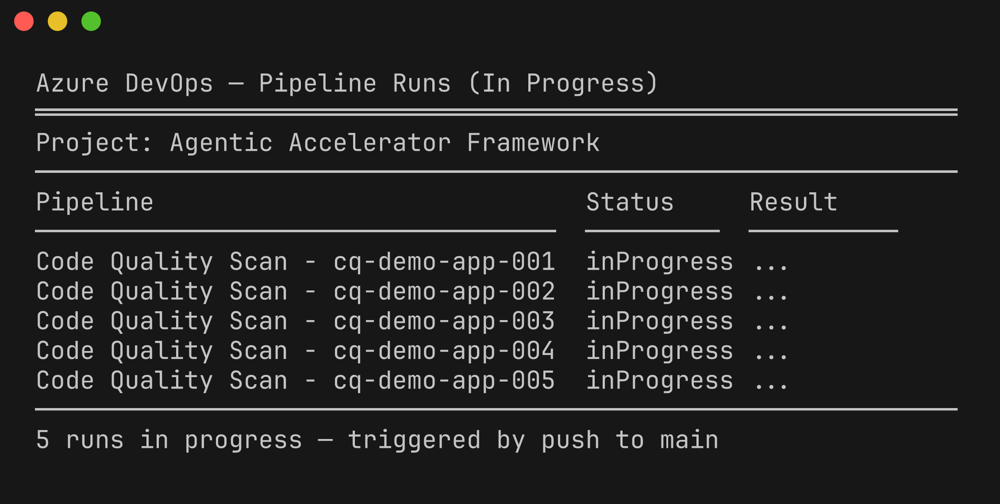
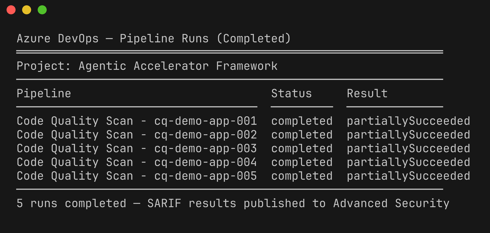
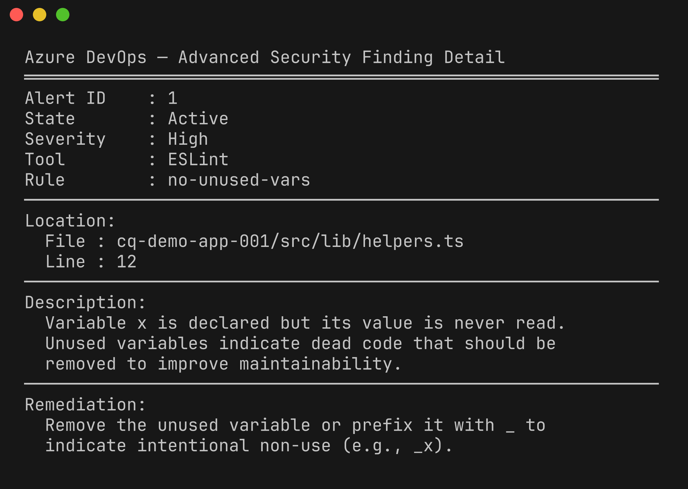

# Lab 06-ADO : Pipelines ADO CI/CD

| Durée | Niveau | Prérequis |
|-------|--------|-----------|
| 30 min | Intermédiaire | Lab 05 |

## Objectifs d'apprentissage

- Importer le pipeline `code-quality-scan.yml` dans Azure DevOps
- Exécuter le pipeline d'analyse et surveiller son exécution
- Consulter les résultats SARIF dans ADO Advanced Security
- Comprendre les différences entre l'intégration des analyses GitHub et ADO

## Prérequis

- Avoir terminé le [Lab 05 : Analyse de couverture](../../fr/labs/lab-05-coverage/)
- Accès à l'organisation Azure DevOps `MngEnvMCAP675646` et au projet `Agentic Accelerator Framework`
- ADO Advanced Security activé sur le projet (nécessite une licence Azure DevOps Advanced Security)

## Exercices

### Exercice 1 : Importer le dépôt dans Azure DevOps

Si le dépôt n'a pas encore été importé dans ADO, utilisez le script de démarrage ou importez-le manuellement :

1. Accédez à **Azure DevOps → Projet → Repos → Import**.
2. Saisissez l'URL de clonage : `https://github.com/devopsabcs-engineering/code-quality-scan-demo-app.git`.
3. Cliquez sur **Import**.

Vous pouvez également utiliser le script `bootstrap-demo-apps-ado.ps1` qui automatise ce processus.


### Exercice 2 : Créer le pipeline

1. Accédez à **Pipelines → New Pipeline**.
2. Sélectionnez **Azure Repos Git** comme source.
3. Sélectionnez le dépôt importé `code-quality-scan-demo-app`.
4. Sélectionnez **Existing Azure Pipelines YAML file**.
5. Choisissez le chemin : `.azuredevops/pipelines/code-quality-scan.yml`.
6. Cliquez sur **Run** pour enregistrer et exécuter le pipeline.

La structure du pipeline ADO reflète le workflow GitHub Actions :

```yaml
trigger:
  branches:
    include:
      - main

pool:
  vmImage: 'ubuntu-latest'

strategy:
  matrix:
    app001:
      APP_ID: '001'
    app002:
      APP_ID: '002'
    app003:
      APP_ID: '003'
    app004:
      APP_ID: '004'
    app005:
      APP_ID: '005'

steps:
  - script: |
      # Run linter for the target app
      # Run complexity analysis
      # Run duplication detection
      # Run coverage
    displayName: 'Code Quality Scan'

  - task: AdvancedSecurity-Publish@1
    inputs:
      SarifFileDirectory: '$(Build.ArtifactStagingDirectory)'
```

### Exercice 3 : Surveiller l'exécution du pipeline

1. Accédez à **Pipelines → Recent runs**.
2. Cliquez sur le pipeline en cours d'exécution pour voir la progression des jobs.
3. Chaque job de la matrice s'exécute indépendamment et produit sa propre sortie SARIF.



Attendez que les 5 jobs de la matrice soient terminés :



### Exercice 4 : Consulter les résultats dans ADO Advanced Security

1. Accédez à **Repos → Advanced Security**.
2. Les résultats SARIF téléchargés par la tâche `AdvancedSecurity-Publish@1` apparaissent ici.
3. Filtrez par :
   - **Sévérité** : Critique, Élevée, Moyenne, Faible
   - **Outil** : Le nom du scanner provenant du champ SARIF `tool.driver.name`
   - **Règle** : Identifiants de règles individuels


### Exercice 5 : Examiner un résultat

Cliquez sur n'importe quel résultat pour voir sa vue détaillée :

- **Identifiant de règle** et description
- **Emplacement du fichier** avec numéro de ligne
- **Sévérité** mappée depuis le niveau SARIF
- **Conseils de remédiation** provenant du champ SARIF `help.markdown`



### Exercice 6 : Comparer l'intégration GitHub vs. ADO

| Fonctionnalité | GitHub | Azure DevOps |
|----------------|--------|-------------|
| Téléchargement SARIF | `codeql-action/upload-sarif@v4` | `AdvancedSecurity-Publish@1` |
| Tableau de bord des résultats | Security → Code scanning alerts | Repos → Advanced Security |
| Prise en charge des catégories | Paramètre `category` | Automatique à partir du nom de l'outil |
| Intégration PR | Vérifications Code scanning sur les PR | Annotations Advanced Security sur les PR |
| Accès API | Code Scanning API | ADO Advanced Security API |
| Licence | Gratuit pour les dépôts publics | Nécessite une licence ADO Advanced Security |

Les deux plateformes consomment le même format SARIF v2.1.0, de sorte que le workflow du scanner produit une sortie identique quel que soit la plateforme CI/CD.

## Point de vérification

Vérifiez votre travail avant de continuer :

- [ ] Vous avez importé le dépôt dans Azure DevOps
- [ ] Vous avez créé et exécuté le pipeline à partir de `.azuredevops/pipelines/code-quality-scan.yml`
- [ ] Les 5 jobs de la matrice se sont terminés avec succès
- [ ] Vous pouvez consulter les résultats SARIF dans ADO Advanced Security
- [ ] Vous avez examiné le détail d'au moins un résultat

## Résumé

Azure DevOps Pipelines offre des capacités d'analyse de qualité de code équivalentes à GitHub Actions. La même architecture à 4 outils s'exécute dans ADO avec des jobs matriciels, et les résultats SARIF sont publiés dans ADO Advanced Security via la tâche `AdvancedSecurity-Publish@1`. La différence principale réside dans le tableau de bord des résultats — ADO utilise **Repos → Advanced Security** au lieu de **Security → Code scanning alerts** de GitHub.

## Étapes suivantes

Passez au [Lab 07-ADO : Remédiation ADO](../../fr/labs/lab-07-ado-remediation/) ou revenez pour essayer le [Lab 06 : GitHub Actions CI/CD](../../fr/labs/lab-06-github-actions/).
