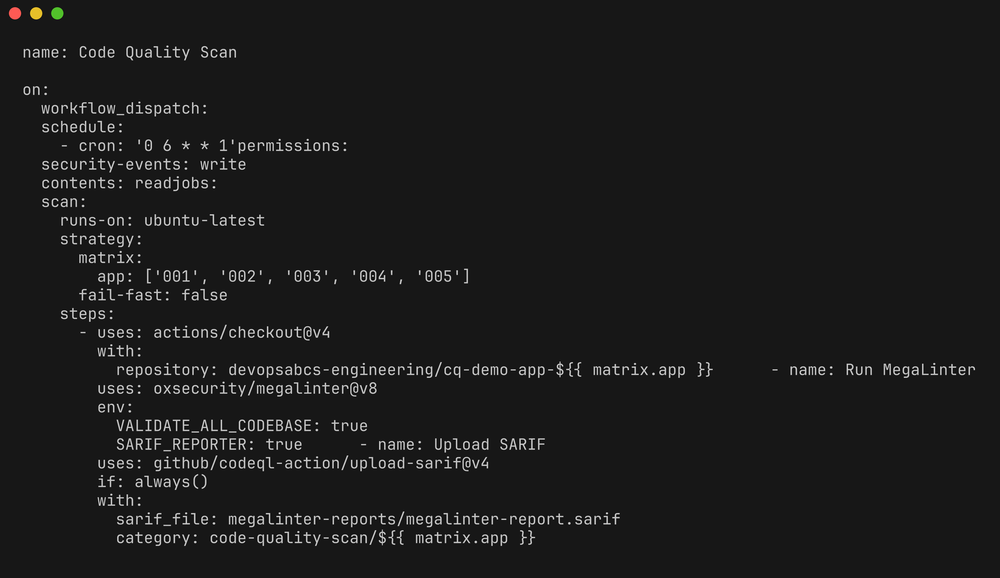
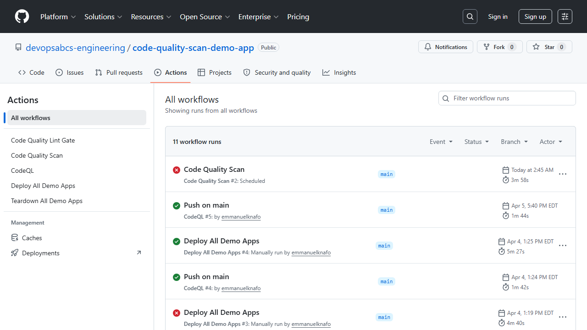
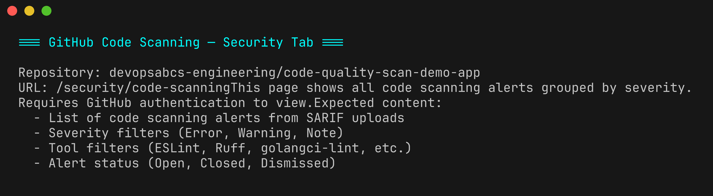
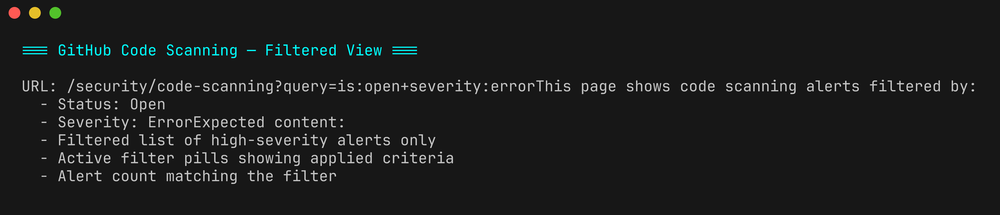
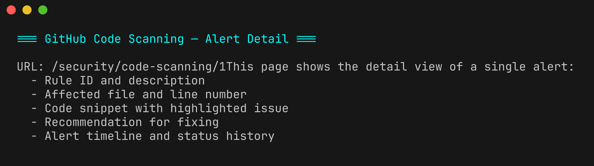

# Lab 06 : GitHub Actions CI/CD

| Durée | Niveau | Prérequis |
|-------|--------|-----------|
| 30 min | Intermédiaire | Lab 05 |

## Objectifs d'apprentissage

- Comprendre la structure du workflow GitHub Actions `code-quality-scan.yml`
- Exécuter le workflow de scan manuellement via workflow dispatch
- Consulter les résultats SARIF dans l'onglet GitHub Security
- Filtrer les findings par sévérité, catégorie et outil
- Comprendre la stratégie matrix pour le scan multi-applications

## Prérequis

- [Lab 05 : Analyse de couverture](../lab-05-coverage/) terminé
- Votre fork de `code-quality-scan-demo-app` poussé sur GitHub
- GitHub Advanced Security activé sur le dépôt (gratuit pour les dépôts publics)

## Exercices

### Exercice 1 : Explorer le workflow de scan

> **Répertoire de travail** : Exécutez les commandes suivantes depuis la racine du dépôt `code-quality-scan-demo-app`.

Ouvrez le fichier central du workflow de scan :

```powershell
Get-Content .github/workflows/code-quality-scan.yml
```

Sections clés du workflow :

| Section | Objectif |
|---------|----------|
| `on:` | Déclencheurs : `push` sur main, `pull_request` et `workflow_dispatch` (manuel) |
| `strategy.matrix` | Scanne les 5 applications : `app: [001, 002, 003, 004, 005]` |
| `steps` — Lint | Exécute le linter spécifique au langage pour l'application cible |
| `steps` — Complexity | Exécute Lizard et convertit en SARIF |
| `steps` — Duplication | Exécute jscpd sur l'application |
| `steps` — Coverage | Exécute les tests avec couverture et convertit en SARIF |
| `steps` — Upload | Téléverse tous les fichiers SARIF vers l'onglet GitHub Security |

Le workflow utilise une **stratégie matrix** pour scanner les 5 applications en parallèle :

```yaml
strategy:
  matrix:
    app: [001, 002, 003, 004, 005]
  fail-fast: false
```

Chaque job de la matrix téléverse le SARIF avec un préfixe de catégorie unique : `code-quality-scan/${{ matrix.app }}`.



### Exercice 2 : Exécuter le workflow manuellement

Déclenchez le workflow de scan à l'aide du GitHub CLI :

```powershell
gh workflow run code-quality-scan.yml --ref main
```

Surveillez l'exécution du workflow :

```powershell
gh run list --workflow=code-quality-scan.yml --limit 1
```

Attendez que l'exécution se termine (cela prend 3 à 5 minutes selon les runners) :

```powershell
$runId = gh run list --workflow=code-quality-scan.yml --limit 1 --json databaseId --jq ".[0].databaseId"
gh run watch $runId
```


### Exercice 3 : Consulter les résultats du workflow

Une fois le workflow terminé, vérifiez le statut :

```powershell
gh run view $runId
```

Consultez les logs d'un job matrix spécifique :

```powershell
gh run view $runId --log | Select-Object -First 100
```



### Exercice 4 : Explorer l'onglet GitHub Security

Ouvrez l'onglet GitHub Security dans votre navigateur :

```powershell
$repoUrl = gh repo view --json url --jq ".url"
Start-Process "$repoUrl/security/code-scanning"
```

Ou naviguez manuellement : **Dépôt → Security → Code scanning alerts**.

L'onglet Security affiche tous les findings SARIF téléversés par le workflow :

- **Code scanning alerts** — findings provenant des linters, de la complexité et de la duplication
- **Filtrage par sévérité** — filtrer par Error, Warning ou Note
- **Filtrage par outil** — filtrer par ESLint, Ruff, Lizard, jscpd, etc.
- **Filtrage par catégorie** — filtrer par `code-quality-scan/001` à `code-quality-scan/005`



### Exercice 5 : Filtrer les findings

Dans l'onglet GitHub Security, pratiquez le filtrage :

**Par sévérité :**
- Cliquez sur **Error** pour voir uniquement les findings critiques (CCN > 20, couverture < 50 %)
- Cliquez sur **Warning** pour voir les findings modérés (CCN 11–20, couverture 50–79 %)

**Par outil :**
- Filtrez par nom d'outil pour voir les findings d'un scanner spécifique

**Par catégorie :**
- Utilisez le filtre de catégorie pour voir les findings d'une application de démonstration spécifique



### Exercice 6 : Examiner le détail d'un finding

Cliquez sur n'importe quel finding pour voir sa vue détaillée :

- **Description de la règle** — ce que la règle vérifie
- **Emplacement** — chemin du fichier et numéro de ligne
- **Conseils de remédiation** — comment corriger le problème
- **Documentation d'aide** — lien vers la documentation de la règle



Le champ SARIF `help.markdown` est rendu ici, fournissant des conseils de remédiation contextuels. C'est pourquoi l'enrichissement SARIF (ajout de `help.markdown`, `properties.tags` et `partialFingerprints`) est important — il rend l'expérience de triage plus riche.

## Point de vérification

Vérifiez votre travail avant de continuer :

- [ ] Vous avez déclenché le workflow `code-quality-scan.yml` avec succès
- [ ] Le workflow s'est terminé avec les 5 jobs matrix
- [ ] Vous pouvez consulter les findings SARIF dans l'onglet GitHub Security
- [ ] Vous avez filtré les findings par sévérité, outil et catégorie
- [ ] Vous avez examiné la vue détaillée d'au moins un finding

## Résumé

Le workflow `code-quality-scan.yml` automatise l'ensemble de l'architecture de scan à 4 outils dans GitHub Actions. Grâce à une stratégie matrix, il scanne les 5 applications de démonstration en parallèle et téléverse les résultats vers l'onglet GitHub Security via SARIF. Cela fournit une vue centralisée de tous les findings de qualité du code — erreurs de lint, avertissements de complexité, duplication et lacunes de couverture — dans un tableau de bord unique.

Points clés à retenir :
- La **stratégie matrix** permet le scan en parallèle de plusieurs applications
- Le **téléversement SARIF** via `codeql-action/upload-sarif@v4` s'intègre avec GitHub Security
- Les **préfixes de catégorie** séparent les findings par application pour faciliter le triage
- Le **SARIF enrichi** (help.markdown, tags, fingerprints) améliore l'expérience de triage

## Étapes suivantes

Passez au [Lab 07 : Remédiation (GitHub)](../lab-07-remediation-github/) ou revenez essayer le [Lab 06-ADO : ADO Pipelines CI/CD](../lab-06-ado-pipelines/).
