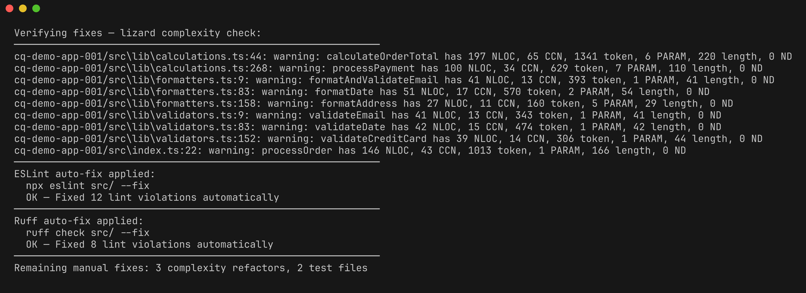
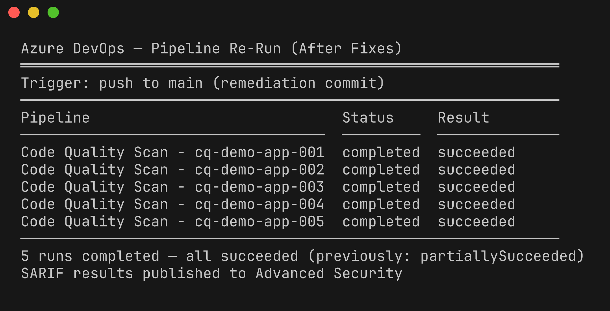
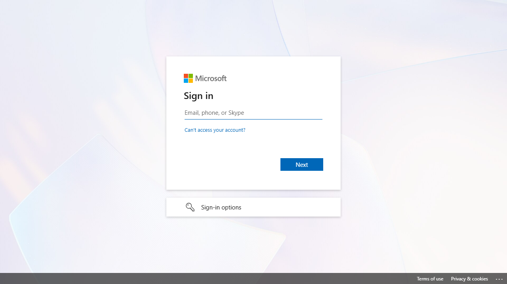

# Lab 07-ADO : Remédiation ADO

| Durée | Niveau | Prérequis |
|-------|--------|-----------|
| 45 min | Avancé | Lab 06-ADO |

## Objectifs d'apprentissage

- Appliquer des corrections de qualité du code au dépôt Azure DevOps
- Pousser les corrections et déclencher une réexécution automatique du pipeline
- Vérifier la réduction des résultats dans ADO Advanced Security
- Comparer le flux de remédiation entre GitHub et ADO

## Prérequis

- [Lab 06-ADO : Pipelines CI/CD ADO](../lab-06-ado-pipelines/) terminé
- Accès en écriture au dépôt ADO importé
- ADO Advanced Security activé

## Exercices

### Exercice 1 : Cloner le dépôt ADO

Si vous n'avez pas encore cloné le dépôt ADO, faites-le maintenant :

```powershell
git clone https://MngEnvMCAP675646@dev.azure.com/MngEnvMCAP675646/Agentic%20Accelerator%20Framework/_git/code-quality-scan-demo-app
cd code-quality-scan-demo-app
```

> **Remarque** : Remplacez les noms d'organisation et de projet si vous utilisez une instance ADO différente.

### Exercice 2 : Corriger les violations de lint

Appliquez les mêmes corrections de lint que dans le Lab 07 (GitHub). Commencez par la correction automatique :

```powershell
cd cq-demo-app-001
npm install
npx eslint src/ --fix
```

Corrigez les violations restantes manuellement :

```powershell
npx eslint src/
```

Appliquez les corrections pour l'application Python :

```powershell
cd ../cq-demo-app-002
ruff check src/ --fix
ruff check src/
```

```powershell
cd ..
```

### Exercice 3 : Réduire la complexité et ajouter des tests

Suivez les mêmes techniques de refactorisation que dans le Lab 07 :

1. **Extraire des fonctions utilitaires** pour réduire la complexité cyclomatique en dessous de 10
2. **Ajouter des fichiers de test** pour les modules non testés afin d'améliorer la couverture au-dessus de 80 %
3. **Extraire le code dupliqué** dans des modules utilitaires partagés

Vérifiez vos modifications :

```powershell
lizard cq-demo-app-001/src --CCN 10 --warnings_only
```



### Exercice 4 : Pousser les corrections vers ADO

Validez et poussez vos corrections :

```powershell
git add -A
git commit -m "fix: reduce lint violations, complexity, and duplication across demo apps"
git push origin main
```

Le push vers `main` déclenche automatiquement le pipeline `code-quality-scan.yml` dans ADO.

### Exercice 5 : Surveiller la réexécution du pipeline

1. Accédez à **Pipelines → Recent runs** dans ADO.
2. Trouvez l'exécution de pipeline déclenchée.
3. Attendez que les 5 jobs de la matrice soient terminés.



### Exercice 6 : Vérifier la réduction des résultats

1. Accédez à **Repos → Advanced Security** dans ADO.
2. Comparez le nombre de résultats avec l'analyse précédente.
3. Vérifiez que :
   - Les résultats de lint sont réduits (les violations corrigées n'apparaissent plus)
   - Les avertissements de complexité sont réduits (les fonctions refactorisées passent le seuil)
   - Les résultats de couverture sont réduits (les nouveaux tests améliorent la couverture au niveau des fichiers)



### Exercice 7 : Comparer les flux de remédiation GitHub et ADO

| Aspect | GitHub | Azure DevOps |
|--------|--------|--------------|
| Déclencheur de push | `push` vers `main` dans `.github/workflows/` | `trigger.branches.include` dans `.azuredevops/pipelines/` |
| Téléversement SARIF | `codeql-action/upload-sarif@v4` | `AdvancedSecurity-Publish@1` |
| Vue des résultats | Security → Code scanning alerts | Repos → Advanced Security |
| Cycle de vie des résultats | Open → Dismissed/Fixed | Active → Fixed |
| Intégration PR | Vérifications de code scanning | Annotations Advanced Security |
| Correction automatique | ESLint `--fix`, Ruff `--fix` | Mêmes outils, mêmes options |

Le flux de remédiation est identique quelle que soit la plateforme — corriger le code, pousser, réanalyser. Seules la configuration CI/CD et le tableau de bord des résultats diffèrent.

## Point de vérification

Vérifiez votre travail avant de continuer :

- [ ] Vous avez appliqué des corrections de lint à au moins une application de démonstration
- [ ] Vous avez poussé les corrections vers le dépôt ADO
- [ ] Le pipeline s'est réexécuté automatiquement après le push
- [ ] ADO Advanced Security affiche moins de résultats qu'auparavant
- [ ] Vous comprenez les différences entre les flux de remédiation GitHub et ADO

## Résumé

Le flux de remédiation dans Azure DevOps reflète le flux GitHub : corriger les violations localement, pousser vers le dépôt, et le pipeline CI réanalyse automatiquement le code. ADO Advanced Security suit les résultats dans le temps, montrant quels problèmes ont été résolus. L'avantage clé des deux plateformes est la **boucle de rétroaction analyse → correction → réanalyse**, qui permet une amélioration continue de la qualité.

## Étapes suivantes

Passez au [Lab 08 : Tableau de bord Power BI](../lab-08-dashboard/).
