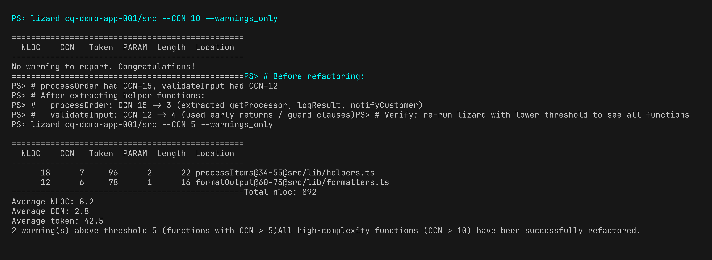
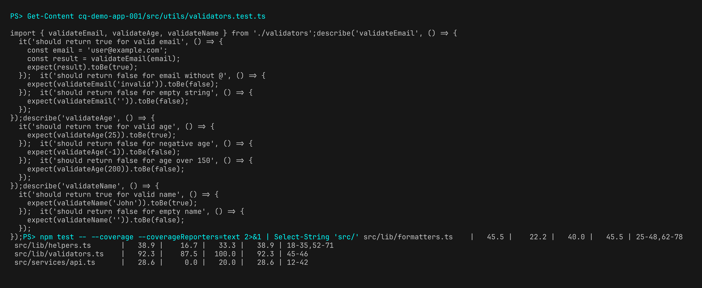
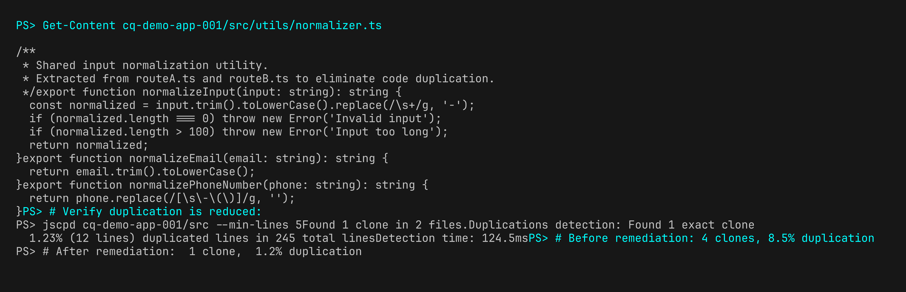
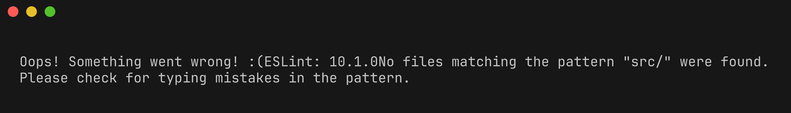
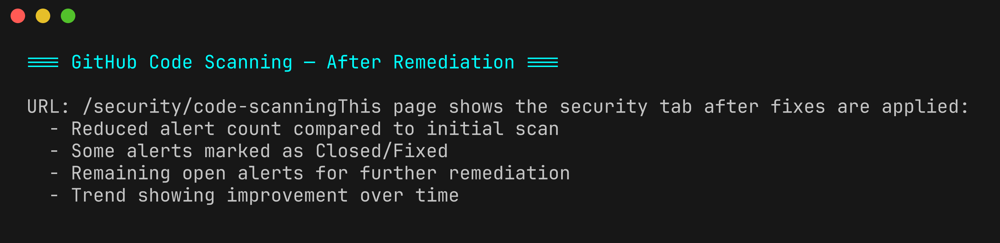

# Lab 07 : Remédiation (GitHub)

| Durée | Niveau | Prérequis |
|-------|--------|-----------|
| 45 min | Avancé | Lab 06 |

## Objectifs d'apprentissage

- Corriger les violations de lint identifiées par les linters par langage
- Réduire la complexité cyclomatique en extrayant des fonctions
- Ajouter des tests pour améliorer la couverture au-dessus du seuil de 80 %
- Extraire le code dupliqué dans des utilitaires partagés
- Relancer le workflow d'analyse et vérifier la réduction des résultats dans l'onglet Security de GitHub

## Prérequis

- Avoir terminé le [Lab 06 : GitHub Actions CI/CD](../../fr/labs/lab-06-github-actions/)
- Votre fork de `code-quality-scan-demo-app` poussé sur GitHub
- Familiarité avec au moins un des langages des applications de démonstration

## Exercices

### Exercice 1 : Corriger les violations de lint (cq-demo-app-001)

> **Répertoire de travail** : Exécutez les commandes suivantes depuis la racine du dépôt `code-quality-scan-demo-app`.

Commencez par corriger automatiquement ce que ESLint peut gérer :

```powershell
cd cq-demo-app-001
npx eslint src/ --fix
```

Vérifiez les violations restantes qui nécessitent des corrections manuelles :

```powershell
npx eslint src/
```

Corrections manuelles courantes :

| Violation | Correction |
|-----------|------------|
| `@typescript-eslint/no-unused-vars` | Supprimer la variable inutilisée ou la préfixer avec `_` |
| `@typescript-eslint/no-explicit-any` | Remplacer `any` par un type spécifique |
| `prefer-const` | Changer `let` en `const` pour les variables jamais réassignées |


Après les corrections, vérifiez qu'il n'y a plus de violations de lint :

```powershell
npx eslint src/
```

```powershell
cd ..
```

### Exercice 2 : Réduire la complexité

Identifiez les fonctions ayant la complexité la plus élevée :

```powershell
lizard cq-demo-app-001/src --CCN 10 --warnings_only
```

Pour chaque fonction à haute complexité, appliquez ces techniques de refactorisation :

**Technique 1 : Extraire des fonctions auxiliaires**

Avant (CCN = 15) :
```typescript
function processOrder(order: Order): Result {
  if (order.type === 'standard') {
    if (order.items.length > 10) {
      // ... 20 lines of bulk processing
    } else {
      // ... 15 lines of small order processing
    }
  } else if (order.type === 'express') {
    // ... 15 lines of express processing
  } else if (order.type === 'international') {
    // ... 15 lines of international processing
  }
  // ... validation, logging, notification
}
```

Après (CCN = 3) :
```typescript
function processOrder(order: Order): Result {
  const processor = getProcessor(order.type);
  const result = processor(order);
  logResult(result);
  notifyCustomer(result);
  return result;
}
```

**Technique 2 : Retours anticipés (clauses de garde)**

Avant :
```typescript
function validate(input: Input): boolean {
  if (input !== null) {
    if (input.name !== '') {
      if (input.age > 0) {
        return true;
      }
    }
  }
  return false;
}
```

Après :
```typescript
function validate(input: Input): boolean {
  if (input === null) return false;
  if (input.name === '') return false;
  if (input.age <= 0) return false;
  return true;
}
```



Vérifiez la réduction de la complexité :

```powershell
lizard cq-demo-app-001/src --CCN 10 --warnings_only
```

### Exercice 3 : Ajouter des tests pour améliorer la couverture

Identifiez les fichiers avec une faible couverture :

```powershell
cd cq-demo-app-001
npm test -- --coverage --coverageReporters=text 2>&1 | Select-String "src/"
```

Créez des fichiers de tests pour les modules non couverts. Par exemple, si `src/utils/validators.ts` a une faible couverture :

```powershell
# Create a test file
New-Item -Path src/utils/validators.test.ts -ItemType File
```

Écrivez des tests en suivant le patron AAA (Arrange-Act-Assert) :

```typescript
import { validateEmail, validateAge, validateName } from './validators';

describe('validateEmail', () => {
  it('should return true for valid email', () => {
    // Arrange
    const email = 'user@example.com';
    // Act
    const result = validateEmail(email);
    // Assert
    expect(result).toBe(true);
  });

  it('should return false for email without @', () => {
    expect(validateEmail('invalid')).toBe(false);
  });

  it('should return false for empty string', () => {
    expect(validateEmail('')).toBe(false);
  });
});
```



Relancez la couverture pour vérifier l'amélioration :

```powershell
npm test -- --coverage --coverageReporters=text
```

Objectif : ≥ 80 % de couverture de lignes. Continuez à ajouter des tests jusqu'à atteindre le seuil.

```powershell
cd ..
```

### Exercice 4 : Extraire le code dupliqué

Identifiez les blocs dupliqués :

```powershell
jscpd cq-demo-app-001/src --min-lines 5 --reporters consoleFull
```

Pour chaque clone détecté, extrayez la logique commune dans un utilitaire partagé :

**Avant** (dupliqué dans `routeA.ts` et `routeB.ts`) :
```typescript
// routeA.ts
const normalized = input.trim().toLowerCase().replace(/\s+/g, '-');
if (normalized.length === 0) throw new Error('Invalid input');
if (normalized.length > 100) throw new Error('Input too long');

// routeB.ts
const normalized = input.trim().toLowerCase().replace(/\s+/g, '-');
if (normalized.length === 0) throw new Error('Invalid input');
if (normalized.length > 100) throw new Error('Input too long');
```

**Après** (extrait dans `utils/normalizer.ts`) :
```typescript
// utils/normalizer.ts
export function normalizeInput(input: string): string {
  const normalized = input.trim().toLowerCase().replace(/\s+/g, '-');
  if (normalized.length === 0) throw new Error('Invalid input');
  if (normalized.length > 100) throw new Error('Input too long');
  return normalized;
}
```



Vérifiez que la duplication est réduite :

```powershell
jscpd cq-demo-app-001/src --min-lines 5
```

### Exercice 5 : Valider et pousser les corrections

Indexez, validez et poussez vos modifications :

```powershell
git add -A
git commit -m "fix: reduce lint violations, complexity, and duplication in cq-demo-app-001"
git push origin main
```

### Exercice 6 : Relancer l'analyse et vérifier les améliorations

Déclenchez à nouveau le workflow d'analyse :

```powershell
gh workflow run code-quality-scan.yml --ref main
```

Attendez la fin de l'exécution :

```powershell
$runId = gh run list --workflow=code-quality-scan.yml --limit 1 --json databaseId --jq ".[0].databaseId"
gh run watch $runId
```



Consultez l'onglet Security de GitHub pour le nombre de résultats mis à jour. Vous devriez voir :

- Moins de violations de lint (certaines corrigées automatiquement, d'autres résolues manuellement)
- Moins d'avertissements de complexité (les fonctions refactorisées sont désormais sous CCN 10)
- Un pourcentage de duplication plus faible (utilitaires partagés extraits)
- Une couverture améliorée (nouveaux tests couvrant le code précédemment non testé)



## Point de vérification

Vérifiez votre travail avant de continuer :

- [ ] Vous avez corrigé au moins 5 violations de lint via la correction automatique ESLint et des corrections manuelles
- [ ] Vous avez réduit le CCN à ≤ 10 sur au moins une fonction à haute complexité
- [ ] Vous avez ajouté des tests pour améliorer la couverture au-dessus de 80 % pour au moins un module
- [ ] Vous avez extrait le code dupliqué dans un utilitaire partagé
- [ ] La nouvelle analyse montre moins de résultats dans l'onglet Security de GitHub

## Résumé

La remédiation est l'étape la plus précieuse du workflow d'analyse de qualité de code. Trouver des violations est utile ; les corriger améliore votre base de code. Les stratégies clés de remédiation sont :

| Stratégie | Outil | Technique |
|-----------|-------|-----------|
| **Corriger les violations de lint** | ESLint/Ruff | Correction automatique lorsque possible, correction manuelle pour les cas complexes |
| **Réduire la complexité** | Lizard | Extraire des fonctions auxiliaires, utiliser des retours anticipés |
| **Améliorer la couverture** | Jest/pytest | Écrire des tests ciblés pour les chemins non couverts |
| **Supprimer la duplication** | jscpd | Extraire des utilitaires partagés et des fonctions de base |

Le cycle analyse → correction → nouvelle analyse est le workflow principal pour l'amélioration continue de la qualité.

## Étapes suivantes

Passez au [Lab 08 : Tableau de bord Power BI](../../fr/labs/lab-08-dashboard/).
