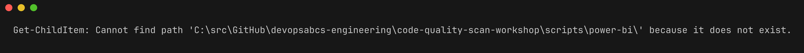
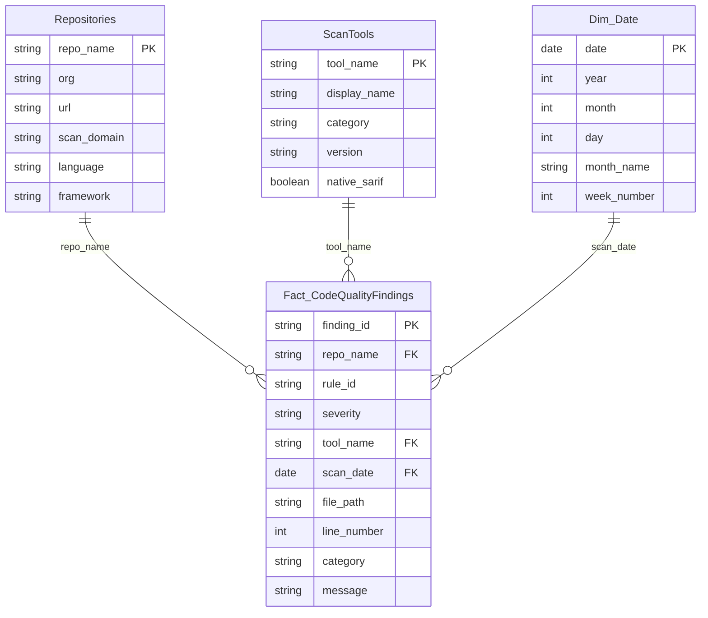
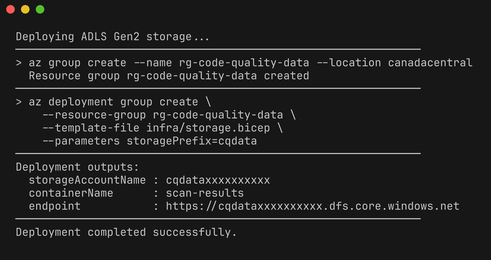
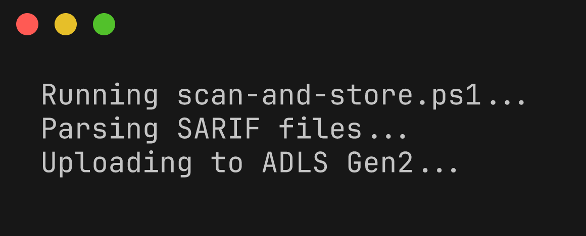
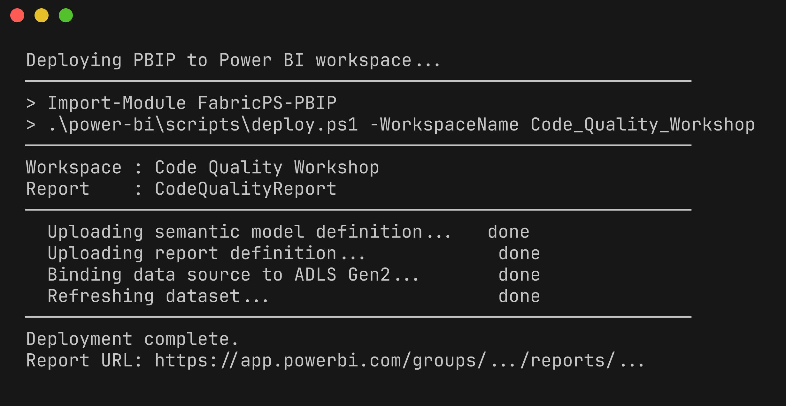
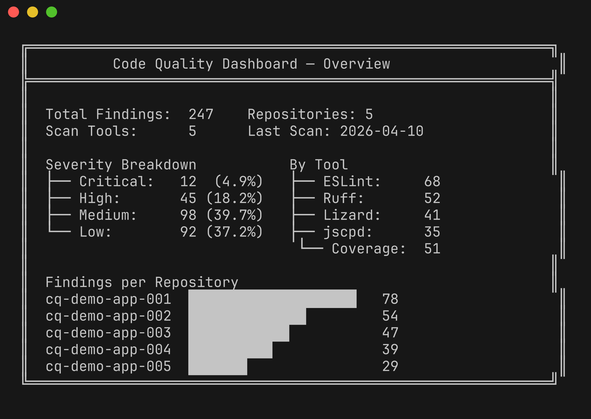
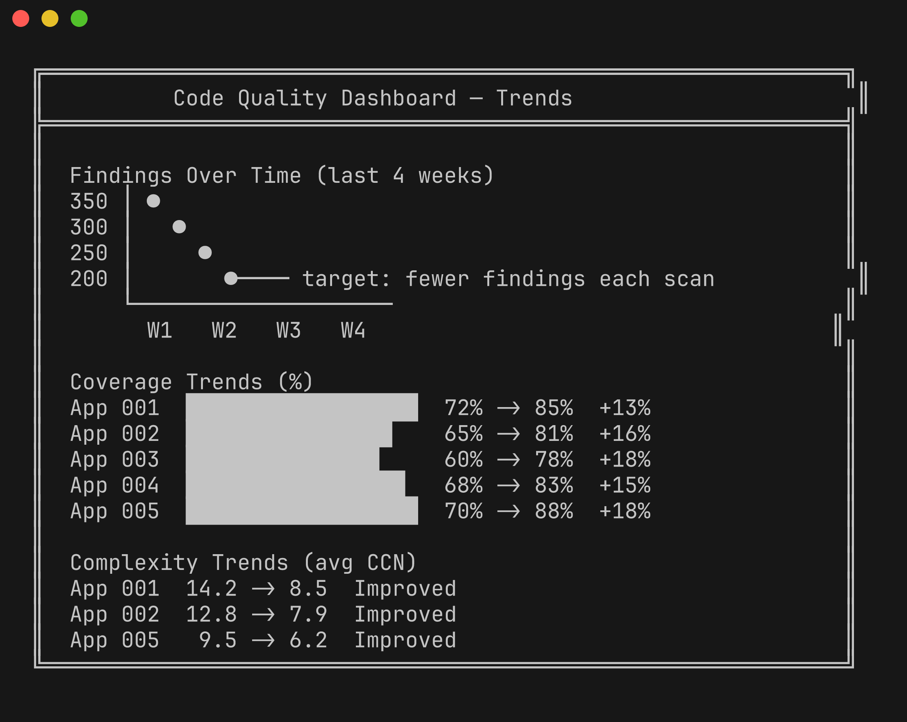
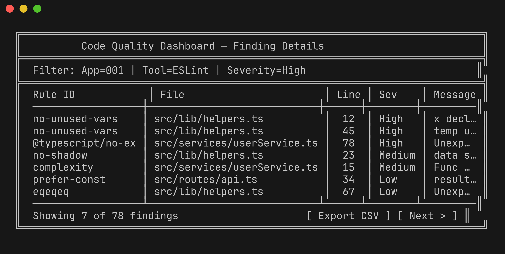

# Lab 08 : Tableau de bord Power BI

| Durée | Niveau | Prérequis |
|-------|--------|-----------|
| 45 min | Avancé | Lab 07 ou Lab 07-ADO |

## Objectifs d'apprentissage

- Comprendre le format Power BI PBIP (Project) et le modèle de données en étoile
- Déployer le rapport PBIP dans un espace de travail Power BI
- Configurer la connexion à la source de données ADLS Gen2
- Exécuter `scan-and-store.ps1` pour alimenter le lac de données avec les résultats d'analyse
- Explorer les tableaux de bord de qualité : vue d'ensemble, tendances et détails des résultats

## Prérequis

- [Lab 07 : Remédiation (GitHub)](../lab-07-remediation-github/) ou [Lab 07-ADO : Remédiation (ADO)](../lab-07-ado-remediation/) terminé
- Power BI Desktop installé (ou accès à Power BI Service)
- Un abonnement Azure avec un stockage ADLS Gen2 (ou utiliser le modèle Bicep fourni)
- Espace de travail Power BI avec accès en écriture

## Exercices

### Exercice 1 : Explorer la structure PBIP

> **Répertoire de travail** : Exécutez les commandes suivantes depuis la racine du dépôt `code-quality-scan-demo-app`.

Affichez le répertoire du projet Power BI :

```powershell
Get-ChildItem power-bi/ -Recurse | Select-Object FullName
```

La structure PBIP suit le format de projet Power BI textuel de Microsoft :

```
power-bi/
├── CodeQualityReport.pbip              # Project file
├── CodeQualityReport.Report/           # Report definition
│   ├── .platform
│   ├── definition.pbir
│   └── definition/
│       ├── report.json                 # Report layout
│       ├── version.json
│       └── pages/                      # Report pages
└── CodeQualityReport.SemanticModel/    # Data model
    ├── .platform
    ├── definition.pbism
    └── definition/
        ├── database.tmdl              # Database metadata
        ├── model.tmdl                 # Model configuration
        ├── relationships.tmdl         # Table relationships
        ├── expressions.tmdl           # Power Query M expressions
        └── tables/                    # Table definitions (TMDL)
            ├── Fact_CodeQualityFindings.tmdl
            ├── Repositories.tmdl
            ├── ScanTools.tmdl
            └── Dim_Date.tmdl
```



### Exercice 2 : Comprendre le schéma en étoile

Le modèle de données utilise un schéma en étoile optimisé pour l'analyse des résultats d'analyse :



| Table | Type | Objectif |
|-------|------|----------|
| `Fact_CodeQualityFindings` | Fact | Une ligne par résultat issu des analyses |
| `Repositories` | Dimension | Métadonnées du dépôt (nom, langage, framework) |
| `ScanTools` | Dimension | Métadonnées de l'outil (ESLint, Ruff, Lizard, jscpd, coverage) |
| `Dim_Date` | Dimension | Table de calendrier générée par DAX pour l'intelligence temporelle |

### Exercice 3 : Déployer le stockage ADLS Gen2

Déployez l'infrastructure de stockage à l'aide du modèle Bicep fourni :

```powershell
$resourceGroup = "rg-code-quality-data"
$location = "canadacentral"

az group create --name $resourceGroup --location $location
az deployment group create `
    --resource-group $resourceGroup `
    --template-file infra/storage.bicep `
    --parameters storagePrefix="cqdata"
```

Notez le nom du compte de stockage dans la sortie du déploiement — vous en aurez besoin pour la configuration de la source de données.



### Exercice 4 : Exécuter scan-and-store.ps1

Le script `scan-and-store.ps1` analyse les fichiers SARIF des résultats d'analyse et téléverse du JSON structuré vers ADLS Gen2 :

```powershell
$storageAccount = "cqdataxxxxxxxxxxx"  # Replace with your storage account name
$container = "scan-results"

.\scripts\scan-and-store.ps1 `
    -StorageAccountName $storageAccount `
    -ContainerName $container `
    -SarifDirectory "." `
    -Domain "code-quality"
```

Le script :
1. Recherche tous les fichiers `.sarif` dans le répertoire spécifié
2. Analyse chaque fichier SARIF pour extraire les résultats
3. Transforme les résultats selon le schéma de la table de faits
4. Téléverse les fichiers JSON vers ADLS Gen2 organisés par date : `{yyyy}/{MM}/{dd}/{appId}-{tool}.json`



### Exercice 5 : Déployer le rapport PBIP

Ouvrez le PBIP dans Power BI Desktop :

```powershell
Start-Process "power-bi/CodeQualityReport.pbip"
```

Ou déployez de manière programmatique à l'aide du module `FabricPS-PBIP` :

```powershell
Install-Module -Name FabricPS-PBIP -Scope CurrentUser -Force
Import-Module FabricPS-PBIP

# Deploy to Power BI Service
.\power-bi\scripts\deploy.ps1 `
    -WorkspaceName "Code Quality Workshop" `
    -PbipPath "power-bi/CodeQualityReport.pbip"
```

Configurez la source de données :

```powershell
.\power-bi\scripts\setup-parameters.ps1 `
    -StorageAccountName $storageAccount `
    -ContainerName $container
```



### Exercice 6 : Explorer le tableau de bord

Une fois les données chargées, explorez les pages du rapport :

**Vue d'ensemble de la qualité** — KPI de haut niveau :
- Total des résultats pour toutes les applications et tous les outils
- Résultats par sévérité (Critique, Élevé, Moyen, Faible)
- Résultats par outil (ESLint, Ruff, Lizard, jscpd, Coverage)
- Résultats par dépôt



**Tendances de la qualité** — Analyse de séries temporelles :
- Résultats dans le temps (tendance à la hausse ou à la baisse)
- Tendances de couverture par application
- Tendances de complexité par application



**Détails des résultats** — Tableau détaillé :
- Résultats individuels avec chemin de fichier, numéro de ligne, identifiant de règle
- Filtrage par application, outil, sévérité et plage de dates
- Export en CSV pour analyse complémentaire



### Exercice 7 : Rapports inter-domaines

La table de dimension `Repositories` inclut une colonne `scan_domain` qui permet les rapports inter-domaines. Si vous avez configuré les ateliers d'analyse d'accessibilité ou FinOps avec le même stockage ADLS Gen2, vous pouvez voir les résultats de tous les domaines dans un seul rapport Power BI.

| Domaine | Valeur scan_domain | Applications |
|---------|--------------------|--------------|
| Qualité du code | `CodeQuality` | `cq-demo-app-001` à `005` |
| Accessibilité | `Accessibility` | `a11y-demo-app-001` à `005` |
| FinOps | `FinOps` | `finops-demo-app-001` à `005` |

## Point de vérification

Vérifiez votre travail avant de continuer :

- [ ] Vous avez déployé le stockage ADLS Gen2 à l'aide du modèle Bicep
- [ ] Vous avez exécuté `scan-and-store.ps1` pour téléverser les résultats d'analyse
- [ ] Vous avez ouvert ou déployé le rapport PBIP
- [ ] Vous pouvez voir les résultats dans la page Vue d'ensemble de la qualité
- [ ] Vous avez exploré les tendances et les pages de détails des résultats

## Résumé

Le tableau de bord Power BI offre une visibilité au niveau exécutif sur la qualité du code de toutes les applications de démonstration. Le modèle de données en étoile, alimenté par le stockage ADLS Gen2, permet le filtrage par outil, sévérité, dépôt et période. Le script `scan-and-store.ps1` fait le lien entre les résultats d'analyse CI/CD et le modèle de données Power BI en transformant les résultats SARIF en fichiers JSON structurés.

Points clés à retenir :
- Le format **PBIP** permet une gestion de projet Power BI textuelle et compatible Git
- Le **schéma en étoile** offre des requêtes analytiques efficaces avec des tables de dimension
- **ADLS Gen2** sert de lac de données central pour les résultats d'analyse de tous les domaines
- Les **rapports inter-domaines** sont rendus possibles grâce à la dimension partagée `Repositories`

## Atelier terminé ! 🎉

Félicitations ! Vous avez terminé tous les labs de l'atelier Code Quality Scan. Vous savez maintenant comment :

1. ✅ Exécuter des linters par langage sur 5 langages différents
2. ✅ Analyser la complexité cyclomatique avec Lizard
3. ✅ Détecter la duplication de code avec jscpd
4. ✅ Mesurer la couverture de tests et convertir en SARIF
5. ✅ Intégrer l'analyse dans GitHub Actions et ADO Pipelines
6. ✅ Remédier aux violations et vérifier les améliorations
7. ✅ Visualiser les métriques de qualité dans des tableaux de bord Power BI
