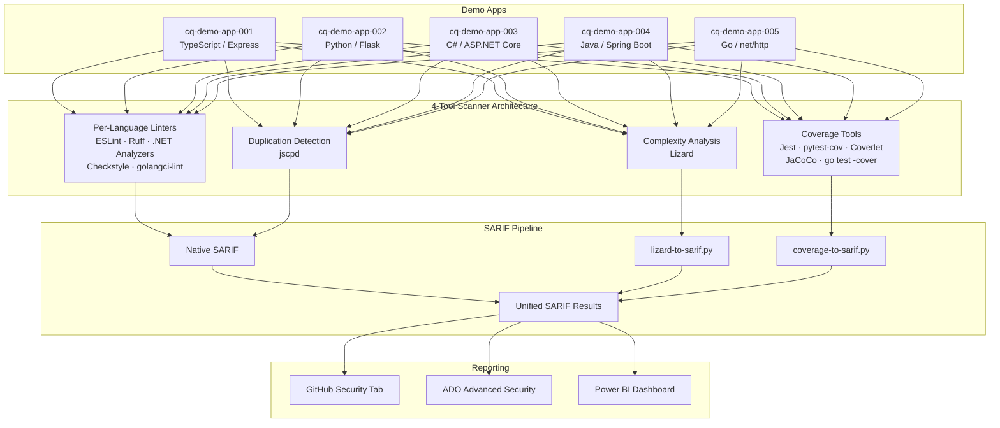

# Code Quality Scan Workshop

Welcome to the **Code Quality Scan Workshop** — a hands-on, progressive workshop that teaches you how to integrate code quality scanning into your CI/CD pipelines using industry-standard open-source tools.

You will scan five demo applications written in TypeScript, Python, C#, Java, and Go using a **4-tool scanning architecture**: per-language linters, code duplication detection, cyclomatic complexity analysis, and test coverage measurement. All results are normalized to [SARIF v2.1.0](https://docs.oasis-open.org/sarif/sarif/v2.1.0/sarif-v2.1.0.html) for unified reporting in GitHub Advanced Security or Azure DevOps Advanced Security.

## Architecture Overview

## Prerequisites

Before starting the workshop, ensure you have the following installed:

- **Node.js** 20+ and npm
- **Python** 3.12+ and pip
- **.NET SDK** 8.0+
- **Java** 21+ (JDK) and Maven
- **Go** 1.22+
- **Docker Desktop** (or Docker-in-Docker in Codespaces)
- **Visual Studio Code** with recommended extensions
- **GitHub CLI** (`gh`) authenticated to your GitHub account
- A **GitHub account** with access to the `devopsabcs-engineering` organization (or your own fork)

See [Lab 00: Prerequisites](labs/lab-00-prerequisites/) for detailed installation instructions.

## Labs

| # | Lab | Duration | Level |
|---|-----|----------|-------|
| 00 | [Prerequisites](labs/lab-00-prerequisites/) | 30 min | Beginner |
| 01 | [Explore Demo Apps](labs/lab-01-explore-demo-apps/) | 30 min | Beginner |
| 02 | [Linting](labs/lab-02-linting/) | 45 min | Intermediate |
| 03 | [Complexity Analysis](labs/lab-03-complexity/) | 30 min | Intermediate |
| 04 | [Duplication Detection](labs/lab-04-duplication/) | 30 min | Intermediate |
| 05 | [Coverage Analysis](labs/lab-05-coverage/) | 45 min | Intermediate |
| 06 | [GitHub Actions CI/CD](labs/lab-06-github-actions/) | 30 min | Intermediate |
| 06-ADO | [ADO Pipelines CI/CD](labs/lab-06-ado-pipelines/) | 30 min | Intermediate |
| 07 | [Remediation (GitHub)](labs/lab-07-remediation-github/) | 45 min | Advanced |
| 07-ADO | [Remediation (ADO)](labs/lab-07-ado-remediation/) | 45 min | Advanced |
| 08 | [Power BI Dashboard](labs/lab-08-dashboard/) | 45 min | Advanced |

## Workshop Schedule

### Half-Day (3.5 hours)

| Time | Activity |
|------|----------|
| 0:00 – 0:30 | Lab 00: Prerequisites |
| 0:30 – 1:00 | Lab 01: Explore Demo Apps |
| 1:00 – 1:45 | Lab 02: Linting |
| 1:45 – 2:15 | Lab 03: Complexity Analysis |
| 2:15 – 2:45 | Lab 04: Duplication Detection |
| 2:45 – 3:00 | Break |
| 3:00 – 3:30 | Lab 06: GitHub Actions (or Lab 06-ADO) |

### Full-Day (7 hours)

| Time | Activity |
|------|----------|
| 0:00 – 0:30 | Lab 00: Prerequisites |
| 0:30 – 1:00 | Lab 01: Explore Demo Apps |
| 1:00 – 1:45 | Lab 02: Linting |
| 1:45 – 2:15 | Lab 03: Complexity Analysis |
| 2:15 – 2:45 | Lab 04: Duplication Detection |
| 2:45 – 3:00 | Break |
| 3:00 – 3:45 | Lab 05: Coverage Analysis |
| 3:45 – 4:15 | Lab 06: GitHub Actions |
| 4:15 – 4:45 | Lab 06-ADO: ADO Pipelines |
| 4:45 – 5:00 | Break |
| 5:00 – 5:45 | Lab 07: Remediation (GitHub) |
| 5:45 – 6:30 | Lab 07-ADO: Remediation (ADO) |
| 6:30 – 6:45 | Break |
| 6:45 – 7:00 | Lab 08: Power BI Dashboard |

## Getting Started

1. **Fork or use this template** to create your own workshop instance.
2. Complete [Lab 00: Prerequisites](labs/lab-00-prerequisites/) to set up your environment.
3. Work through the labs in order — each lab builds on the previous one.

> **Tip**: This workshop is designed for GitHub Codespaces. Click **Code → Codespaces → New codespace** to get a pre-configured environment with all tools installed.
