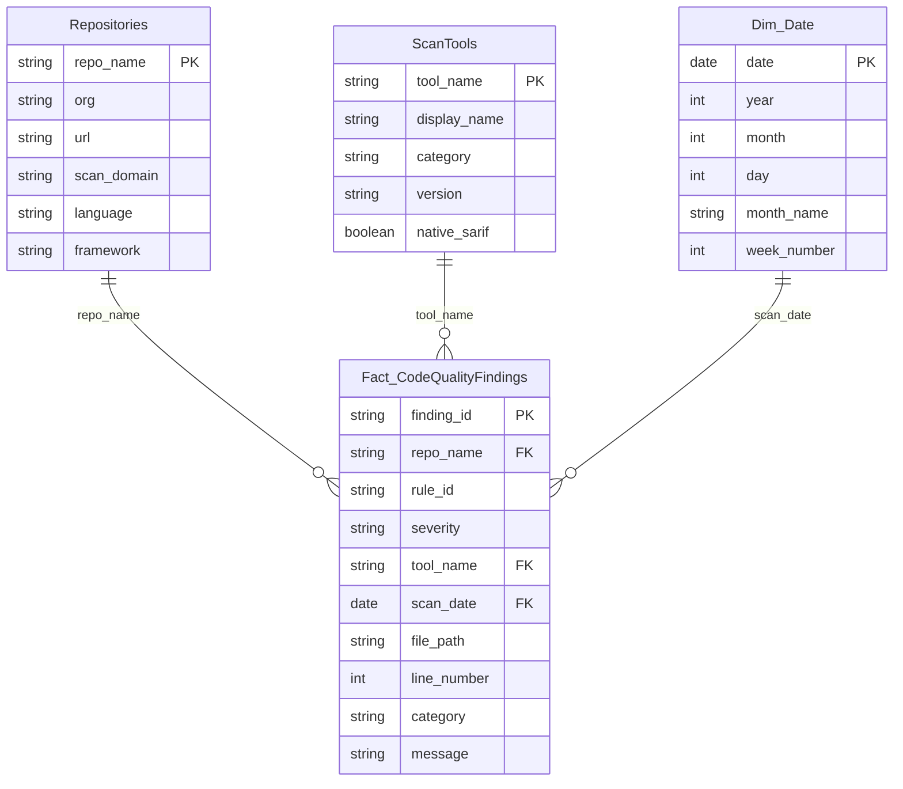

# Lab 08: Power BI Dashboard

| Duration | Level | Prerequisites |
|----------|-------|---------------|
| 45 min | Advanced | Lab 07 or Lab 07-ADO |

## Learning Objectives

- Understand the Power BI PBIP (Project) format and star schema data model
- Deploy the PBIP report to a Power BI workspace
- Configure the ADLS Gen2 data source connection
- Run `scan-and-store.ps1` to populate the data lake with scan results
- Explore quality dashboards: overview, trends, and finding details

## Prerequisites

- Completed [Lab 07: Remediation (GitHub)](../lab-07-remediation-github/) or [Lab 07-ADO: ADO Remediation](../lab-07-ado-remediation/)
- Power BI Desktop installed (or access to Power BI Service)
- An Azure subscription with ADLS Gen2 storage (or use the provided Bicep template)
- Power BI workspace with write access

## Exercises

### Exercise 1: Explore the PBIP Structure

> **Working Directory**: Run the following commands from the `code-quality-scan-demo-app` repository root.

View the Power BI project directory:

```powershell
Get-ChildItem power-bi/ -Recurse | Select-Object FullName
```

The PBIP structure follows Microsoft's text-based Power BI project format:

```
power-bi/
├── CodeQualityReport.pbip              # Project file
├── CodeQualityReport.Report/           # Report definition
│   ├── .platform
│   ├── definition.pbir
│   └── definition/
│       ├── report.json                 # Report layout
│       ├── version.json
│       └── pages/                      # Report pages
└── CodeQualityReport.SemanticModel/    # Data model
    ├── .platform
    ├── definition.pbism
    └── definition/
        ├── database.tmdl              # Database metadata
        ├── model.tmdl                 # Model configuration
        ├── relationships.tmdl         # Table relationships
        ├── expressions.tmdl           # Power Query M expressions
        └── tables/                    # Table definitions (TMDL)
            ├── Fact_CodeQualityFindings.tmdl
            ├── Repositories.tmdl
            ├── ScanTools.tmdl
            └── Dim_Date.tmdl
```


### Exercise 2: Understand the Star Schema

The data model uses a star schema optimized for scan result analysis:



| Table | Type | Purpose |
|-------|------|---------|
| `Fact_CodeQualityFindings` | Fact | One row per finding from scan results |
| `Repositories` | Dimension | Repository metadata (name, language, framework) |
| `ScanTools` | Dimension | Tool metadata (ESLint, Ruff, Lizard, jscpd, coverage) |
| `Dim_Date` | Dimension | DAX-generated calendar table for time intelligence |

### Exercise 3: Deploy ADLS Gen2 Storage

Deploy the storage infrastructure using the provided Bicep template:

```powershell
$resourceGroup = "rg-code-quality-data"
$location = "canadacentral"

az group create --name $resourceGroup --location $location
az deployment group create `
    --resource-group $resourceGroup `
    --template-file infra/storage.bicep `
    --parameters storagePrefix="cqdata"
```

Note the storage account name from the deployment output — you'll need it for the data source configuration.


### Exercise 4: Run scan-and-store.ps1

The `scan-and-store.ps1` script parses SARIF files from scan results and uploads structured JSON to ADLS Gen2:

```powershell
$storageAccount = "cqdataxxxxxxxxxxx"  # Replace with your storage account name
$container = "scan-results"

.\scripts\scan-and-store.ps1 `
    -StorageAccountName $storageAccount `
    -ContainerName $container `
    -SarifDirectory "." `
    -Domain "code-quality"
```

The script:
1. Scans for all `.sarif` files in the specified directory
2. Parses each SARIF file to extract findings
3. Transforms findings into the fact table schema
4. Uploads JSON files to ADLS Gen2 organized by date: `{yyyy}/{MM}/{dd}/{appId}-{tool}.json`


### Exercise 5: Deploy the PBIP Report

Open the PBIP in Power BI Desktop:

```powershell
Start-Process "power-bi/CodeQualityReport.pbip"
```

Or deploy programmatically using the `FabricPS-PBIP` module:

```powershell
Install-Module -Name FabricPS-PBIP -Scope CurrentUser -Force
Import-Module FabricPS-PBIP

# Deploy to Power BI Service
.\power-bi\scripts\deploy.ps1 `
    -WorkspaceName "Code Quality Workshop" `
    -PbipPath "power-bi/CodeQualityReport.pbip"
```

Configure the data source:

```powershell
.\power-bi\scripts\setup-parameters.ps1 `
    -StorageAccountName $storageAccount `
    -ContainerName $container
```


### Exercise 6: Explore the Dashboard

Once data is loaded, explore the report pages:

**Quality Overview** — Top-level KPIs:
- Total findings across all apps and tools
- Findings by severity (Critical, High, Medium, Low)
- Findings by tool (ESLint, Ruff, Lizard, jscpd, Coverage)
- Findings per repository


**Quality Trends** — Time-series analysis:
- Findings over time (trending up or down)
- Coverage trends per app
- Complexity trends per app


**Finding Details** — Drill-down table:
- Individual findings with file path, line number, rule ID
- Filter by app, tool, severity, and date range
- Export to CSV for further analysis


### Exercise 7: Cross-Domain Reporting

The `Repositories` dimension table includes a `scan_domain` column that enables cross-domain reporting. If you have the Accessibility or FinOps scan workshops set up with the same ADLS Gen2 storage, you can see findings from all domains in a single Power BI report.

| Domain | scan_domain Value | Apps |
|--------|-------------------|------|
| Code Quality | `CodeQuality` | `cq-demo-app-001` through `005` |
| Accessibility | `Accessibility` | `a11y-demo-app-001` through `005` |
| FinOps | `FinOps` | `finops-demo-app-001` through `005` |

## Verification Checkpoint

Verify your work before continuing:

- [ ] You deployed ADLS Gen2 storage using the Bicep template
- [ ] You ran `scan-and-store.ps1` to upload scan results
- [ ] You opened or deployed the PBIP report
- [ ] You can see findings in the Quality Overview page
- [ ] You explored trends and finding detail drill-down pages

## Summary

The Power BI dashboard provides executive-level visibility into code quality across all demo applications. The star schema data model, sourced from ADLS Gen2 storage, enables filtering by tool, severity, repository, and time period. The `scan-and-store.ps1` script bridges the gap between CI/CD scan results and the Power BI data model by transforming SARIF findings into structured JSON files.

Key takeaways:
- **PBIP format** enables Git-friendly, text-based Power BI project management
- **Star schema** provides efficient analytical queries with dimension tables
- **ADLS Gen2** serves as the central data lake for scan results across all domains
- **Cross-domain reporting** is enabled through the shared `Repositories` dimension

## Workshop Complete! 🎉

Congratulations! You have completed all labs in the Code Quality Scan Workshop. You now know how to:

1. ✅ Run per-language linters on 5 different languages
2. ✅ Analyze cyclomatic complexity with Lizard
3. ✅ Detect code duplication with jscpd
4. ✅ Measure test coverage and convert to SARIF
5. ✅ Integrate scanning into GitHub Actions and ADO Pipelines
6. ✅ Remediate violations and verify improvements
7. ✅ Visualize quality metrics in Power BI dashboards
